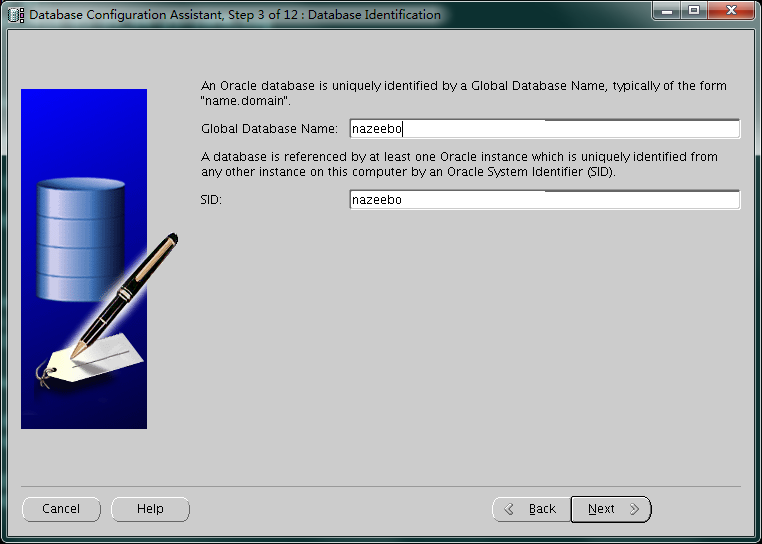

<!-- toc --> 

* * * * *
### 0.概述
在单机上安装asm，和安装集群类似，用grid用户安装cluster相关软件，用oracle用户安装

###  1. 主机准备
#### 1.1 主机名和网络配置
```
hostname
vi /etc/sysconfig/network
vi /etc/hosts
```

#### 1.2 磁盘准备

#### 1.3 如果为非桌面环境，考虑先安装桌面相应的包（非必须）
```
yum -y groupinstall "X Window System" "Chinese Support" "Desktop" 
yum -y install xterm
```
#### 1.4 安装相应的rpm包
```
yum -y install binutils compat-libstdc++-33 elfutils-libelf elfutils-libelf-devel glibc glibc-common glibc-devel gcc- gcc-c++ libaio-devel libaio libgcc libstdc++ libstdc++-devel make sysstat unixODBC unixODBC-devel pdksh ksh compat-libcap1
```
#### 1.5 关闭防火墙等
```
service iptables stop
chkconfig iptables off
service NetworkManager stop
chkconfig NetworkManager off
```

### 2. 创建用户和用户组
```
groupadd oinstall
groupadd dba
groupadd oper
groupadd asmadmin
groupadd asmdba
groupadd asmoper
useradd -g oinstall -G dba,asmdba,oper oracle
useradd -g oinstall -G dba,asmadmin,asmdba,asmoper grid
```

```
passwd grid
passwd oracle
```

### 3. 创建目录和赋予权限
```
mkdir -p /u01/app/11.2.0.4/grid
mkdir -p /u01/app/grid
mkdir -p /u01/app/oracle/product/11.2.0.4/db_1
chown -R oracle:oinstall /u01/app
chmod -R 775 /u01/app
```

### 4. 系统配置
#### 4.1 内核参数
 vi /etc/sysctl.conf
```
fs.aio-max-nr = 1048576
fs.file-max = 6815744
kernel.shmall = 2097152
#kernel.shmmax = 4398046511104  //一般设置为系统内存75%单位是字节
kernel.shmmni = 4096
kernel.sem = 250 32000 100 128
net.ipv4.ip_local_port_range = 9000 65500
net.core.rmem_default = 262144
net.core.rmem_max = 4194304
net.core.wmem_default = 262144
net.core.wmem_max = 1048586
```
```
使内核设置立即生效：
shell>  /sbin/sysctl -p 
```
#### 4.2 limit限制
 vi /etc/security/limits.conf
```
oracle soft nproc 2047
oracle hard nproc 16384
oracle soft nofile 1024
oracle hard nofile 65536
oracle soft stack 10240
grid soft nproc 2047
grid hard nproc 16384
grid soft nofile 1024
grid hard nofile 65536
grid soft stack 1024
```
#### 4.3 login限制
vi /etc/pam.d/login
```
session required /lib64/security/pam_limits.so
session required pam_limits.so
```
#### 4.4 grid用户环境变量
```
export ORACLE_BASE=/u01/app/grid
export ORACLE_HOME=/u01/app/11.2.0.4/grid
export LD_LIBRARY_PATH=$ORACLE_HOME/lib:.
export NLS_LANG=American_america.ZHS16GBK
export PATH=$PATH:$ORACLE_HOME/bin:.
export ORACLE_SID=+ASM
```

#### 4.5 oracle用户环境变量
```
export ORACLE_BASE=/u01/app/oracle
export ORACLE_HOME=/u01/app/oracle/product/11.2.0.4/db_1
export LD_LIBRARY_PATH=$ORACLE_HOME/lib:.
export NLS_LANG=AMERICAN_AMERICA.ZHS16GBK
export ORACLE_SID=nazeebo
export PATH=$PATH:$ORACLE_HOME/bin:.
```

### 5. 配置cluster所需要的磁盘组或者裸设备
```
[root@nazeebo ~]# fdisk -l

Disk /dev/vda: 42.9 GB, 42949672960 bytes
255 heads, 63 sectors/track, 5221 cylinders
Units = cylinders of 16065 * 512 = 8225280 bytes
Sector size (logical/physical): 512 bytes / 512 bytes
I/O size (minimum/optimal): 512 bytes / 512 bytes
Disk identifier: 0x00020f78

   Device Boot      Start         End      Blocks   Id  System
/dev/vda1   *           1        5222    41940992   83  Linux

Disk /dev/vdb: 21.5 GB, 21474836480 bytes
16 heads, 63 sectors/track, 41610 cylinders
Units = cylinders of 1008 * 512 = 516096 bytes
Sector size (logical/physical): 512 bytes / 512 bytes
I/O size (minimum/optimal): 512 bytes / 512 bytes
Disk identifier: 0x00000000


Disk /dev/vdc: 26.8 GB, 26843545600 bytes
16 heads, 63 sectors/track, 52012 cylinders
Units = cylinders of 1008 * 512 = 516096 bytes
Sector size (logical/physical): 512 bytes / 512 bytes
I/O size (minimum/optimal): 512 bytes / 512 bytes
Disk identifier: 0x00000000


Disk /dev/vdd: 26.8 GB, 26843545600 bytes
16 heads, 63 sectors/track, 52012 cylinders
Units = cylinders of 1008 * 512 = 516096 bytes
Sector size (logical/physical): 512 bytes / 512 bytes
I/O size (minimum/optimal): 512 bytes / 512 bytes
Disk identifier: 0x00000000

```
在这儿有几种方法：
#### 5.1 用scsi的方式获取到设备的uuid
在这儿，我将用lvm的方式模拟
```
pvcreate /dev/vdb
vgcreate ora_vg /dev/vdb
lvcreate -L 2g -n lv_asm_ocr ora_vg
lvcreate -L 20g -n lv_asm_data ora_vg
lvcreate -L 20g -n lv_asm_arch ora_vg
vgdisplay ora_vg
```

#### 5.2 用raw的方式，有个坏处是系统重启后有可能会是的盘符错乱，使cluster起不来
所谓raw 设备，就是通过字符方式访问的设备，也就是读写设备不需要缓冲区。 在Linux 下，对磁盘值提供了块方式的访问。要想通过字符方式访问，必须配置raw 设备服务，并且Oracle 用户对这些raw 设备必须有访问的权限。
在2个节点上做如下操作：

```
1）修改/etc/udev/rules.d/60-raw.rules 文件
添加如下内容：
ACTION=="add", KERNEL=="vdb",RUN+="/bin/raw /dev/raw/raw1 %N"
ACTION=="add", KERNEL=="vdc",RUN+="/bin/raw /dev/raw/raw2 %N"
ACTION=="add", KERNEL=="vdd",RUN+="/bin/raw /dev/raw/raw3 %N"
ACTION=="add",KERNEL=="raw1", OWNER="grid", GROUP="oinstall", MODE="660"
ACTION=="add",KERNEL=="raw[2-3]", OWNER="oracle", GROUP="oinstall", MODE="660"

2） 重启服务：
shell> start_udev
Starting udev: [ OK ]

3） 查看raw设备：
shell> raw -qa
/dev/raw/raw1:	bound to major 252, minor 16
/dev/raw/raw2:	bound to major 252, minor 32
/dev/raw/raw3:	bound to major 252, minor 48
shell> ls -lrt /dev/raw
total 0
crw-rw---- 1 root   disk     162, 0 May  9 14:30 rawctl
crw-rw---- 1 oracle oinstall 162, 3 May  9 14:30 raw3
crw-rw---- 1 oracle oinstall 162, 2 May  9 14:30 raw2
crw-rw---- 1 grid   oinstall 162, 1 May  9 14:30 raw1

```

#### 5.3安装asmlib，用oracle 提供的操作系统层面的asm管理工具来进行asm磁盘的创建

### 6. 安装grid组件
```
[root@nazeebo softdb]# ll
total 3664224
drwxr-xr-x 7 root root       4096 Aug 27  2013 database
drwxr-xr-x 7 root root       4096 Aug 27  2013 grid
-rw-r--r-- 1 root root 1395582860 May  9 14:40 p13390677_112040_Linux-x86-64_1of7.zip
-rw-r--r-- 1 root root 1151304589 May  9 14:47 p13390677_112040_Linux-x86-64_2of7.zip
-rw-r--r-- 1 root root 1205251894 May  9 14:53 p13390677_112040_Linux-x86-64_3of7.zip
[root@nazeebo softdb]# 
[root@nazeebo softdb]# chown -R grid:oinstall grid
[root@nazeebo softdb]# chown -R oracle:oinstall database/
[root@nazeebo softdb]# ll
total 3664224
drwxr-xr-x 7 oracle oinstall       4096 Aug 27  2013 database
drwxr-xr-x 7 grid   oinstall       4096 Aug 27  2013 grid
-rw-r--r-- 1 root   root     1395582860 May  9 14:40 p13390677_112040_Linux-x86-64_1of7.zip
-rw-r--r-- 1 root   root     1151304589 May  9 14:47 p13390677_112040_Linux-x86-64_2of7.zip
-rw-r--r-- 1 root   root     1205251894 May  9 14:53 p13390677_112040_Linux-x86-64_3of7.zip
[root@nazeebo softdb]# 
```
用grid用户安装

#### 6.1 图形化界面安装过程如图（仅列举关键的图）：

p13390677_112040_Linux-x86-64_3of7.zip


根据提示 用root执行两个脚本
```
[root@nazeebo ~]# /u01/app/oraInventory/orainstRoot.sh 
Changing permissions of /u01/app/oraInventory.
Adding read,write permissions for group.
Removing read,write,execute permissions for world.

Changing groupname of /u01/app/oraInventory to oinstall.
The execution of the script is complete.
[root@nazeebo ~]# /u01/app/11.2.0.4/grid/root.sh 
Performing root user operation for Oracle 11g 

The following environment variables are set as:
    ORACLE_OWNER= grid
    ORACLE_HOME=  /u01/app/11.2.0.4/grid

Enter the full pathname of the local bin directory: [/usr/local/bin]: 
   Copying dbhome to /usr/local/bin ...
   Copying oraenv to /usr/local/bin ...
   Copying coraenv to /usr/local/bin ...


Creating /etc/oratab file...
Entries will be added to the /etc/oratab file as needed by
Database Configuration Assistant when a database is created
Finished running generic part of root script.
Now product-specific root actions will be performed.
Using configuration parameter file: /u01/app/11.2.0.4/grid/crs/install/crsconfig_params
Creating trace directory
LOCAL ADD MODE 
Creating OCR keys for user 'grid', privgrp 'oinstall'..
Operation successful.
LOCAL ONLY MODE 
Successfully accumulated necessary OCR keys.
Creating OCR keys for user 'root', privgrp 'root'..
Operation successful.
CRS-4664: Node nazeebo successfully pinned.
Adding Clusterware entries to upstart

nazeebo     2018/05/09 16:11:36     /u01/app/11.2.0.4/grid/cdata/nazeebo/backup_20180509_161136.olr
Successfully configured Oracle Grid Infrastructure for a Standalone Server
[root@nazeebo ~]# 
```


#### 6.2 用asmca来创建asm磁盘组
切换到grid用户，用asmca图形化工具来创建asm磁盘供之后的database使用
安装过程如图（仅仅列出关键步骤）


用asmcmd也可以看见
```
[grid@nazeebo grid]$ asmcmd
ASMCMD> lsdg
State    Type    Rebal  Sector  Block       AU  Total_MB  Free_MB  Req_mir_free_MB  Usable_file_MB  Offline_disks  Voting_files  Name
MOUNTED  EXTERN  N         512   4096  1048576     25600    25548                0           25548              0             N  ARCH/
MOUNTED  EXTERN  N         512   4096  1048576     25600    25548                0           25548              0             N  DATA/
MOUNTED  EXTERN  N         512   4096  1048576     20480    20421                0           20421              0             N  OCR/
ASMCMD> 

```

### 7. 安装oracle组件
将安装包解压在同一个目录
unzip p13390677_112040_Linux-x86-64_1of7.zip
unzip p13390677_112040_Linux-x86-64_2of7.zip
安装过程如图（仅仅列出关键步骤）


根据提示 用root执行脚本
```
[root@nazeebo ~]# /u01/app/oracle/product/11.2.0.4/db_1/root.sh 
Performing root user operation for Oracle 11g 

The following environment variables are set as:
    ORACLE_OWNER= oracle
    ORACLE_HOME=  /u01/app/oracle/product/11.2.0.4/db_1

Enter the full pathname of the local bin directory: [/usr/local/bin]: 
The contents of "dbhome" have not changed. No need to overwrite.
The contents of "oraenv" have not changed. No need to overwrite.
The contents of "coraenv" have not changed. No need to overwrite.

Entries will be added to the /etc/oratab file as needed by
Database Configuration Assistant when a database is created
Finished running generic part of root script.
Now product-specific root actions will be performed.
Finished product-specific root actions.
[root@nazeebo ~]# 
```


### 8. 配置实例
#### 8.1配置监听
因为用grid安装了cluster的组件用于asm管理，而这一步中，grid已经创建了监听，故不再需要新建监听了。
查看已经创建了的监听的状态
```
[grid@nazeebo ~]$ lsnrctl status

LSNRCTL for Linux: Version 11.2.0.4.0 - Production on 10-MAY-2018 15:48:55

Copyright (c) 1991, 2013, Oracle.  All rights reserved.

Connecting to (DESCRIPTION=(ADDRESS=(PROTOCOL=IPC)(KEY=EXTPROC1521)))
STATUS of the LISTENER
------------------------
Alias                     LISTENER
Version                   TNSLSNR for Linux: Version 11.2.0.4.0 - Production
Start Date                09-MAY-2018 16:15:18
Uptime                    0 days 0 hr. 5 min. 38 sec
Trace Level               off
Security                  ON: Local OS Authentication
SNMP                      OFF
Listener Parameter File   /u01/app/11.2.0.4/grid/network/admin/listener.ora
Listener Log File         /u01/app/grid/diag/tnslsnr/nazeebo/listener/alert/log.xml
Listening Endpoints Summary...
  (DESCRIPTION=(ADDRESS=(PROTOCOL=ipc)(KEY=EXTPROC1521)))
  (DESCRIPTION=(ADDRESS=(PROTOCOL=tcp)(HOST=nazeebo)(PORT=1521)))
Services Summary...
Service "+ASM" has 1 instance(s).
  Instance "+ASM", status READY, has 1 handler(s) for this service...
The command completed successfully
```
#### 8.2dbca建库
安装过程如图（仅仅列出关键步骤）



### 9.常用命令
#### 9.1检查crs相关的状态
> 因为是单机的，所以crsctl check crs和crsctl check cluster都无效
```
[grid@nazeebo ~]$ crsctl check css
CRS-4529: Cluster Synchronization Services is online
[grid@nazeebo ~]$ crsctl check has
CRS-4638: Oracle High Availability Services is online
[grid@nazeebo ~]$ crsctl check evm
CRS-4533: Event Manager is online
```
#### 9.2查看资源状态(nodeapps节点应用程序，ASM实例，数据库实例等)
```
[grid@nazeebo ~]$ crsctl status res -t 
--------------------------------------------------------------------------------
NAME           TARGET  STATE        SERVER                   STATE_DETAILS       
--------------------------------------------------------------------------------
Local Resources
--------------------------------------------------------------------------------
ora.ARCH.dg
               ONLINE  ONLINE       nazeebo                                      
ora.DATA.dg
               ONLINE  ONLINE       nazeebo                                      
ora.LISTENER.lsnr
               ONLINE  ONLINE       nazeebo                                      
ora.OCR.dg
               ONLINE  ONLINE       nazeebo                                      
ora.asm
               ONLINE  ONLINE       nazeebo                  Started             
ora.ons
               OFFLINE OFFLINE      nazeebo                                      
--------------------------------------------------------------------------------
Cluster Resources
--------------------------------------------------------------------------------
ora.cssd
      1        ONLINE  ONLINE       nazeebo                                      
ora.diskmon
      1        OFFLINE OFFLINE                                                   
ora.evmd
      1        ONLINE  ONLINE       nazeebo                                      
ora.nazeebo.db
      1        ONLINE  ONLINE       nazeebo                  Open 
```
> 若资源以ora.开头的 用srvctl 来维护 否则用crsctl
> srvctl 维护的资源包括：ASM，database，instance，service，node applications ,listener,vip address,gns,scan vip ,scan listener ,oracle home, oc4j, server,server pool, asm disk group, asm file system
> 
> 11.2的cluster的 正确启动集群：
> ```
> crsctl start cluster -all  
> crsctl stop cluster -all  
> crsctl check cluster -all
> ```

#### 9.3查看各资源状态(nodeapps节点应用程序，ASM实例，数据库实例等)
```
[grid@nazeebo ~]$ crs_stat -t -v
Name           Type           R/RA   F/FT   Target    State     Host        
----------------------------------------------------------------------
ora.ARCH.dg    ora....up.type 0/5    0/     ONLINE    ONLINE    nazeebo     
ora.DATA.dg    ora....up.type 0/5    0/     ONLINE    ONLINE    nazeebo     
ora....ER.lsnr ora....er.type 0/5    0/     ONLINE    ONLINE    nazeebo     
ora.OCR.dg     ora....up.type 0/5    0/     ONLINE    ONLINE    nazeebo     
ora.asm        ora.asm.type   0/5    0/     ONLINE    ONLINE    nazeebo     
ora.cssd       ora.cssd.type  0/5    0/5    ONLINE    ONLINE    nazeebo     
ora.diskmon    ora....on.type 0/10   0/5    OFFLINE   OFFLINE               
ora.evmd       ora.evm.type   0/10   0/5    ONLINE    ONLINE    nazeebo     
ora.nazeebo.db ora....se.type 0/2    0/1    ONLINE    ONLINE    nazeebo     
ora.ons        ora.ons.type   0/3    0/     OFFLINE   OFFLINE    
```

#### 9.4查看数据库的配置新
```
[grid@nazeebo ~]$ srvctl config database
nazeebo
[grid@nazeebo ~]$ srvctl config database -d nazeebo -a
Database unique name: nazeebo
Database name: nazeebo
Oracle home: /u01/app/oracle/product/11.2.0.4/db_1
Oracle user: oracle
Spfile: +DATA/nazeebo/spfilenazeebo.ora
Domain: 
Start options: open
Stop options: immediate
Database role: PRIMARY
Management policy: AUTOMATIC
Database instance: nazeebo
Disk Groups: DATA,ARCH
Services: 
Database is enabled
```
#### 9.5查看asm的配置信息
```
[grid@nazeebo ~]$  srvctl status asm
ASM is running on nazeebo
[grid@nazeebo ~]$  srvctl status asm -a
ASM is running on nazeebo
ASM is enabled.
[grid@nazeebo ~]$ srvctl config asm -a
ASM home: /u01/app/11.2.0.4/grid
ASM listener: LISTENER
Spfile: +OCR/asm/asmparameterfile/registry.253.975687351
ASM diskgroup discovery string: 
ASM is enabled.
```
#### 9.6查看ocr的配置信息
```
[grid@nazeebo ~]$ ocrcheck
Status of Oracle Cluster Registry is as follows :
	 Version                  :          3
	 Total space (kbytes)     :     262120
	 Used space (kbytes)      :        152
	 Available space (kbytes) :     261968
	 ID                       : 1642006547
	 Device/File Name         : /u01/app/11.2.0.4/grid/cdata/localhost/local.ocr
                                    Device/File integrity check succeeded

                                    Device/File not configured

                                    Device/File not configured

                                    Device/File not configured

                                    Device/File not configured

	 Cluster registry integrity check succeeded

	 Logical corruption check bypassed due to non-privileged user

```

### 10.相关视图
v$asm_disk(_stat)      --查看磁盘及其状态信息
v$asm_diskgroup(_stat) --查看磁盘组及其状态信息
v$asm_operation        --查看当前磁盘的操作信息
v$asm_client           --返回当前连接的客户端实例信息
v$asm_file             --返回asm文件的相关信息
v$asm_template         --返回asm文件样本的相关信息
v$asm_alias            --返回asm文件的别名信息