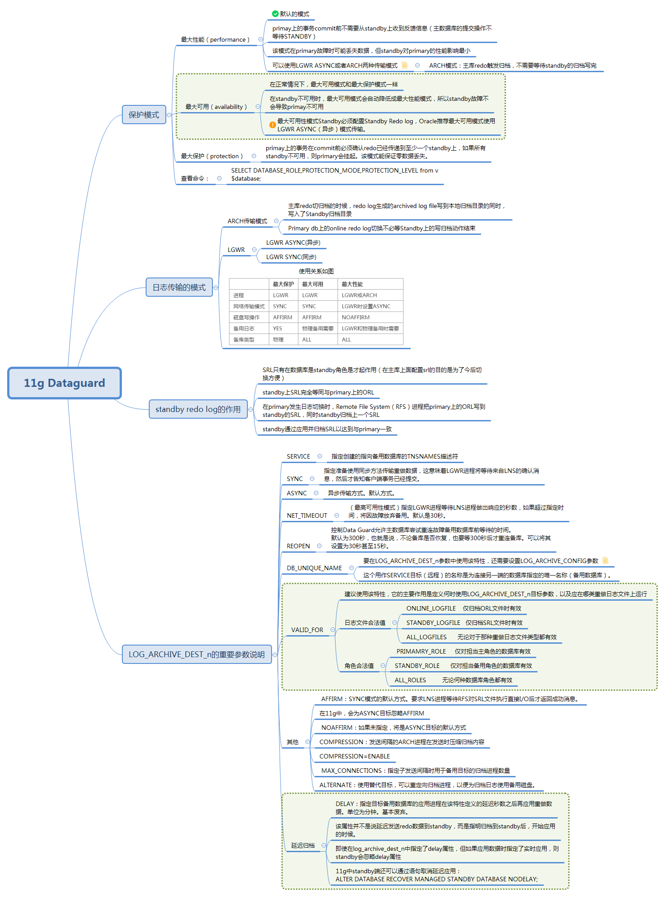

<!-- toc -->

* * * * *


## 保护模式
```
SELECT DATABASE_ROLE,PROTECTION_MODE,PROTECTION_LEVEL from v$database;
```

### 最大性能(maximize performance)
这是dataguard默认的保护模式。primay上的事务commit前不需要从standby上收到反馈信息（主数据库的提交操作不等待STANDBY），该模式在primary故障时可能丢失数据，但standby对primary的性能影响最小。 可以使用LGWR ASYNC或者ARCH两种传输模式。
ARCH传输模式：Primary DB上的online redo log写满或其他条件引起redo log写归档的时候，redo log生成的archived log file写到本地归档目录的同时，写入了Standby归档目录。只是Primary db上的online redo log切换不必等Standby上的写归档动作结束。
### 最大可用(maximize availability)
在正常情况下，最大可用模式和最大保护模式一样；在standby不可用时，最大可用模式会自动降低成最大性能模式，所以standby故障不会导致primay不可用。在问题纠正之后，Standby和主数据库进行再同步，至少有一个standby可用的情况下，即使primary down机，也能保证不丢失数据。(不过当问题修复，再同步之前有必要FAILOVER,那么有些数据可能会丢失)。最大可用性模式Standby必须配置Standby Redo log，Oracle推荐最大可用模式使用LGWR ASYNC（异步）模式传输。

采用最大可用的data guard模式，主库往备库传递在线日志(online redo log)信息，在线日志信息写入备用库的standby redo log,这些standby redo log归档后，备用库应用归档日志。

### 最大保护(maximize protection)
最高级别的保护模式。primay上的事务在commit前必须确认redo已经传递到至少一个standby上，如果所有standby不可用，则primary会挂起。该模式能保证零数据丢失。对于最大保护和最高可用性模式，Standby数据库必须配置standby redo log，并且oracle推荐所有数据库都使用LGWR ASYNC模式传输。


## 日志的传输模式
ARCH传输模式：Primary DB上的online redo log写满或其他条件引起redo log写归档的时候，redo log生成的archived log file写到本地归档目录的同时，写入了Standby归档目录。只是Primary db上的online redo log切换不必等Standby上的写归档动作结束。
LGWR还分为LGWR ASYNC(异步)和LGWR SYNC(同步)两种。


|    |  	最大保护  |   最大可用 |  最大性能  |
| --- | --- | --- | --- |
|  进程  |  LGWR  |   LGWR | LGWR或ARCH   |
|  网络传输模式  |  SYNC  |  SYNC  | LGWR时设置ASYNC   |
|   磁盘写操作 | AFFIRM   |   AFFIRM |  NOAFFIRM  |
|  备用日志  |  YES  |  物理备用需要  |   LGWR和物理备用时需要 |
|   备库类型 |  物理  | ALL   | ALL   |

## 重要参数LOG_ARCHIVE_DEST_n说明

这是Data Guard重做传输的主要参数，通常在主数据库上发挥作用。该参数能用于指定ORL文件或者SRL文件的归档日志文件应该去往哪里。

该参数有17个特性，要使用Data Guard将重做数据正确传输到备用数据库，只需设置其中7个特性。

7个特性：

### SERVICE
指定创建的指向备用数据库的TNSNAMES描述符。
### SYNC
指定准备使用同步方法传输重做数据，这意味着LGWR进程将等待来自LNS的确认消息，然后才告知客户端事务已经提交。

### ASYNC
异步传输方式。默认方式。

### NET_TIMEOUT
（最高可用性模式）指定LGWR进程等待LNS进程做出响应的秒数，如果超过指定时间，将因故障放弃备用。默认是30秒，但根据网络的可靠性， 10～15秒会是更恰当的值，具体取决于网络可靠性。不能设置为低于10秒，那样在备用数据库恢复后，将遇到重连失败的情形，因为完成所有重连需要耗费几秒钟的时间。

### REOPEN
控制Data Guard允许主数据库尝试重连故障备用数据库前等待的时间。 默认为300秒，也就是说，不论备库是否恢复，也要等300秒后才重连备库。可以将其设置为30秒甚至15秒。

### DB_UNIQUE_NAME
要在LOG_ARCHIVE_DEST_n参数中使用该特性，还需要设置LOG_ARCHIVE_CONFIG参数；否则Data Guard将拒绝连接到该目标。这个用作SERVICE目标（远程）的名称是为连接另一端的数据库指定的唯一名称（备用数据库）。
必须将这个唯一名称输入两端数据库的LOG_ARCHIVE_CONFIG参数中。当主数据库连接备用数据库时，会向备用发送自己的唯一数据库名，同时要求备用返回唯一名称。备用将检查配置参数LOG_ARCHIVE_CONFIG，确保主数据库的唯一名称的确存在。如果不存在，将拒绝连接。如果存在，备用数据库会将自己的唯一名称发回到主LNS进程。如果返回值与该特性中指定的值不匹配，连接将终止。

### VALID_FOR
建议使用该特性，它的主要作用是定义何时使用LOG_ARCHIVE_DEST_n目标参数，以及应在哪类重做日志文件上运行。

```
下面是日志文件合法值：

      ONLINE_LOGFILE    仅归档ORL文件时有效
      STANDBY_LOGFILE   仅归档SRL文件时有效
      ALL_LOGFILES      无论对于那种重做日志文件类型都有效


下面是角色合法值：

     PRIMAMRY_ROLE     仅对担当主角色的数据库有效
     STANDBY_ROLE      仅对担当备用角色的数据库有效
     ALL_ROLES         无论何种数据库角色都有效
```

### 实例
现在看一下LOG_ARCHIVE_DEST_n，例如，为主库配置一个最高可用性模式的备库，则在主库中设置LOG_ARCHIVE_DEST_n参数，配置可能如下：
```
log_archive_dest_2='service=tyqxdg1
                  SYNC REOPEN=15 NET_TIMEOUT=15
                  valid_for=(ONLINE_LOGFILES,PRIMARY_ROLE)
                  db_unique_name=tyqxdg'

再添加一个最高性能模式的备库：
log_archive_dest_3='service=tyqxdg2
                  ASYNC REOPEN=15
                  valid_for=(ONLINE_LOGFILES,PRIMARY_ROLE)
                  db_unique_name=tyqxdg2'
```
因为使用适当的DB_UNIQUE_NAME特性，我们也需要定义LOG_ARCHIVE_CONFIG参数：
```
 log_archive_config='dg_config=(tyqx,tyqxdg1,tyqxdg2)'
 ```
### 以下的特性为可选特性：

* AFFIRM：SYNC模式的默认方式。要求LNS进程等待RFS对SRL文件执行直接I/O后才返回成功消息。
* 在Oracle Database 11g中，会为ASYNC目标忽略AFFIRM。
* NOAFFIRM：如果未指定，将是ASYNC目标的默认方式。
* COMPRESSION：发送间隔的ARCH进程在发送时压缩归档内容。
* COMPRESSION=ENABLE
* MAX_CONNECTIONS：指定子发送间隔时用于备用目标的归档进程数量。
* MAX_CONNECTIONS=5
* DELAY：指定目标备用数据库的应用进程在该特性定义的延迟秒数之后再应用重做数据。基本废弃。
* ALTERNATE：使用替代目标，可以重定向归档进程，以便为归档日志使用备用磁盘。

## 主备库的srl和rl
### 主库
- 主库的rl的作用不多说
- 主库的srl在配置完成时，其实是没什么用的，只有当做切换的时候，角色变为standby时才会有用

### 备库
- 备库的rl其实没什么用的，rl在不存在的时候，每次启动时alert会有警告，一旦切换为主库时会自动创建
- 备库的srl的作用在于接收主库传过来的redo log，备库再重新apply，这样就可以做到adg的实时同步。
- 当然，其实备库没有srl也是可以的，这样只是不能做实时同步了，备库就只能收到主库传来的归档日志才可以recover，而且主库配置log_archive_dest_n参数的时候不能用lgwr和sync了。

## 级联更新
有时候生产上，一主多备的需求会变成：一主一备一级联。
这个时候，对于级联库的主备库配置和普通的主备库类似，只是需要注意发送日志的参数里面，log_archive_dest_n要配置成standby的，以及角色要变为standby_logfile，standby_role
