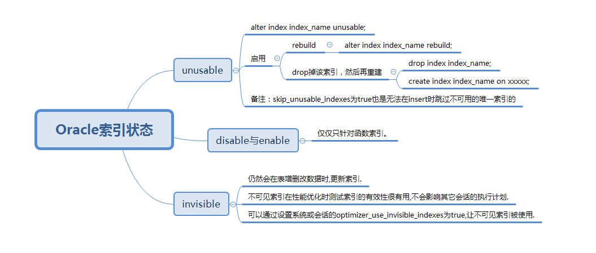

<!-- toc --> 

* * * * *



## unusable
ORACLE使索引变成不可用的状态： 
```
alter index index_name unusable; 
```
执行成功后，如果后续需要再用到该索引的话，就必须重建。重建后会自动变成usable。 

> ORACLE官方文档的说法(An unusable index must be rebulit , or dropped and re-created , before it can be used.) 

unusable状态变回为valid
有两种方式 :
```
1. rebuild 
alter index index_name rebuild; 

2. drop掉该索引，然后再重建。 
drop index index_name; 
create index index_name on xxxxx; 

PS: 实际上这两种操作的结果是一样的，都是删除再重新启用，不过rebulid方式更为快捷和简单。
```

## disable和enable
enable和disable仅仅只针对函数索引
```
alter index index_name enable;

alter index index_name disable;
```
两者的区别是：enable和disable仅仅只针对函数索引。

## invisible
不可见索引会在表增删改数据时,更新索引.不可见索引在性能优化时测试索引的有效性很有用,不会影响其它会话的执行计划.可以通过设置系统或会话的optimizer_use_invisible_indexes为true,让不可见索引被使用.