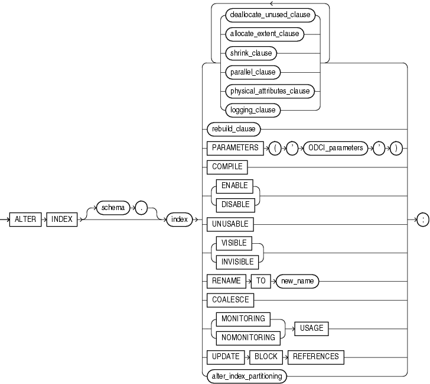

<!-- toc -->

# 索引重建的方法和注意事项




## 以下情况需要重建索引

- 索引或索引分区因为介质故障损坏，例如索引所在表空间数据文件被误删除。
- 索引试图中STATUS列标记为UNUSABLE
- 索引对应基表move到新表空间
- 索引计划迁移到新表空间
- 修改索引的某些存储参数
- 索引高度>3或者>4
- 索引的碎片化>75%

## 重建索引的方法
- 重新创建
  - drop index index_name;
  - create index index_name;
- alter index index_name rebuild;
- alter index index_name rebuild online;


### 方法1：drop + create
在create index语句执行过程中会话一直持有TM锁 Imode=4，阻塞了其他会话增删改等DML语句，直到索引创建完成 。

### 方法2：alter index rebuild
```
When you rebuild an index, you use an existing index as the data source. Creating an index in this manner enables you to change storage characteristics or move to a new tablespace. Rebuilding an index based on an existing data source removes intra-block fragmentation. Compared to dropping the index and using the CREATE INDEX statement, rebuilding an existing index offers better performance.
```
上面的官方文档很明确的说明了rebuild的原理，以原有索引作为基础进行重新创建（可以通过10046确认），且性能要好于drop然后重新create步骤。

- rebuild要持有相关锁，若表有未提交的事务，会报错，因此rebuild前请保证没有相关事务。
- rebuild语句执行过程会话一直持有TM锁Imode=4，阻塞其他会话增删改等DML操作。
- rebuild还有一个值得关注的地方就是空间问题，Oracle在创建新索引过程中，并不会删除旧索引，直至新索引rebuild成功。
  - rebuild过程，若查询操作能用到旧索引依然会用旧索引，查询效率不会因rebuild而降低。
  - rebuild方式创建索引过程需要额外的空闲空间，额外空间的大小基本为旧索引大小，rebuild成功后，rebuild过程占用的额外空间将会被释放。


### 方法3：alter index rebuild online
```
You have the option of rebuilding the index online. Rebuilding online enables you to update base tables at the same time that you are rebuilding. The following statement rebuilds the emp_name index online
```

- rebuild online执行过程中基表可以进行增删改等DML操作，在线rebuild可以保证了业务连续性，比rebuild要高级一些。
- rebuild online索引重建过程也需要额外的空闲空间，另外rebuild online过程中旧索引依然可用。
- 和rebuild不同的一点rebuild online以基表作为基础进行重新创建（可以通过10046确认），因此相对rebuild会慢一些。
- 在rebuild online过程中，oracle会自动维护一日志(journal)表,通过锁以及dba_objects视图的相关信息可以跟踪到该表。
  - 由于要额外维护一张日志表，那么如果在rebuild online过程中，基表发生了大量的增删改操作，整个rebuild online重建索引过程就会异常的慢。
  - 另外还有一个特别重要的说明一下：虽然rebuild index online在执行期间不会阻塞DML操作，但在开始和结束阶段，需要请求模式为4的TM锁。如果在rebuild index online开始前或结束时，有其它长时间的事务在运行会阻塞

### 3种方法的总结
- drop-->create index,alter index rebulid会阻塞基表的增删改DML操作，alter index rebuild online不会阻塞，保证在线重新创建。
- alter index rebulid以及rebuild online重建过程要求有额外的空闲空间，drop-->create index无此要求。
- 一般情况下rebuild速度最快，针对rebuild online请保证重建开始前与结束前无相关事务，否则会rebuild online会一直处于等待状态。
- 上述三种重建索引方法各有利弊，在实际生产环境中具体采用哪种方法请结合具体情况酌情处理。
- 创建索引的语句可以考虑加并行和nologging

## 相关查询语句
### 查询索引碎片>50%的语句
```
col owner format a15;
col table_name format a30;
col index_name format a30;

select
  idx.owner owner,
  idx.table_name tablename,
  idx.index_name index_name,
  idx.blocks idx_blocks,
  tbl.blocks tbl_blocks,
  trunc(idx.blocks/tbl.blocks*100)/100 pct
from
  (select i.owner owner ,i.index_name index_name,SUM(S1.blocks) blocks,i.table_owner table_owner,
	 i.table_name table_name
	 from dba_segments s1,dba_indexes i
	 where
	  s1.owner=i.owner and s1.segment_name=i.index_name and
	  i.owner not in ('SYS','OUTLN','SYSTEM','MGMT_VIEW','SYSMAN','DBSNMP','WMSYS','XDB',
	  'DIP','GOLDENGATE','CTXSYS' )
	 GROUP BY i.owner ,i.index_name ,i.table_owner , i.table_name  ) idx,
  (select	t.owner owner ,t.table_name table_name,SUM(s2.blocks) blocks
	 from dba_segments s2,dba_tables t
	 where
	  s2.owner=t.owner and s2.segment_name=t.table_name and
	  t.owner not in ('SYS','OUTLN','SYSTEM','MGMT_VIEW','SYSMAN','DBSNMP','WMSYS','XDB',
	  'DIP','GOLDENGATE','CTXSYS' )
	  GROUP BY  T.OWNER,T.TABLE_NAME
	  ) tbl
where
	idx.table_owner=tbl.owner and
	idx.table_name=tbl.table_name and
	(idx.blocks/tbl.blocks)>0.5 and
	idx.blocks>200
	order by 4;
```

### 查询索引高度>3
```
 select owner,index_name,table_owner,table_name,BLEVEL from dba_indexes where blevel > 3;
```


## 注意事项与总结
生产系统执行任何操作时，需要明确如下几点：
- 是不是业务时间（或业务高峰期），如果是，则尽量不要进行类此操作。因为在大对象中创建索引时不仅需要较大temp表空间，而且基于表原有索引的所有SQL语句的执行计划都发生变化。这样，这些SQL的重新解释需要大量CPU资源。
- 当原来索引被删除后，出现大量的全表扫描。这不仅对系统I/O产生压力，而且buffer catch中的已缓存数据块很容易被挤出去，不仅对SGA带来压力，而且对I/O产生恶性循环。
- 综合CPU、内存、I/O方面资源紧张，在加上正常业务办理需要的各类DML操作，可能导致`row lock contention、read by other session`等一堆等待，最终系统被出现无法办理业务的等待（系统慢）状态。

因此在进行重建或创建所以之前，很有必要充分考虑生产环境、数据库对象的大小和用途、temp表空间大小，硬件资源、回退方案等等。

注:rebuild和rebuild online的区别
- 当rebuild 时一般对原先索引进行INDEX FAST FULL SCAN。
- 当rebuild online的时不用原先索引而执行TABLE ACCESS FULL
- rebuild和rebuild online都会发生sort，即需要用到temp表空间。
- rebuild 会阻塞dml语句而rebuild online则不会。
- rebuild online时系统会产生一个SYS_JOURNAL_xxx的IOT类型的系统临时日志表，所有rebuild online时索引的变化都记录在这个表中，当新的索引创建完成后，把这个表的记录维护到新的索引中去，然后drop掉旧的索引，rebuild online就完成了。


## 参考文档
>[1]参考官方文档: [Managing Indexes](https://docs.oracle.com/cd/E11882_01/server.112/e25494/indexes.htm#ADMIN13283)
>[2]参考metalink Note:272762.1

```
========
- Online Index rebuild takes a long time.
- ONLINE INDEX REBUILD SCANS THE BASE TABLE AND NOT THE INDEX
Symptoms:
=========
Performance issues while rebuilding very large indexes.
- The offline rebuilds of their index is relatively quick -finishes in 15 minutes.
- Issuing index rebuild ONLINE statement => finishes in about an hour.
- This behavior of ONLINE index rebuilds makes it a non-option for large tables
as it just takes too long to scan the table to rebuild the index. The offline may not be feasible due to due to the 24/7 nature of the database.
- This may be a loss of functionality for such situations.
- If we attempt to simultaneously ONLINE rebuild the same indexes we may encounter hanging behavior indefinitely (or more than 6 hours).


DIAGNOSTICANALYSIS:

--------------------
We can trace the sessions rebuilding the indexes with 10046 level 12.
Comparing the IO reads for the index-rebuild and the index-rebuild-onlinereveals the following:
-ONLINE indexrebuilds
It scans thebase table and it doesn't scan the blocks of the index.


-OFFLINE index rebuilds
It scans the index for the build operation.

- This behaviour is across all versions.


Cause
Cause/Explanation
=============
When you rebuild index online,

- it will do a full tablescan on thebase table.

- At the same time it will maintaina journal table for DML data, which has changed during this index rebuildingoperation.

So it shouldtake longer time, specially if you do lots of DML on the same table,whilerebuilding index online.
On the other hand, while rebuilding the index without online option, Oraclewill grab the index in X-mode and rebuild a new index segment by selecting thedata from the old index. So here we are
- not allowing any DML on the table hence there is nojournal table involved
- and it is doing an index scan
Hence it will be pretty fast.
Fix
Solution/Conclusion:
===========
- The ONLINE index rebuild reads the base table, and this is by design.
- Rebuilding index ONLINE is pretty slow.
- Rebuilding index offline is very fast, but it prevents any DML on the basetable.
```
