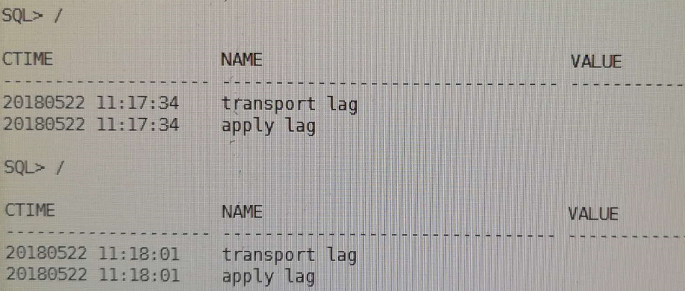
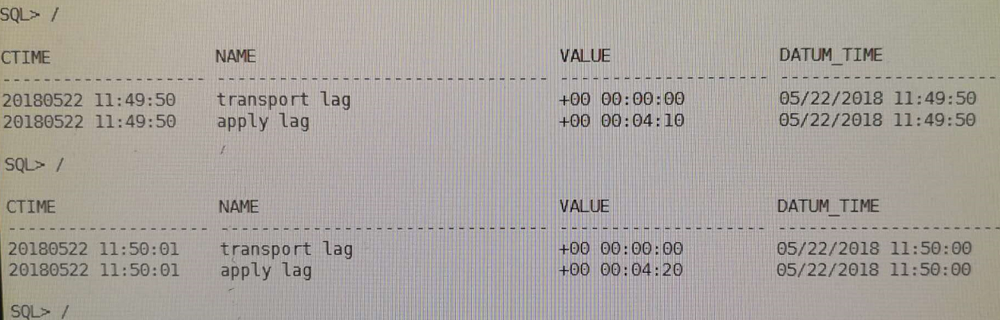
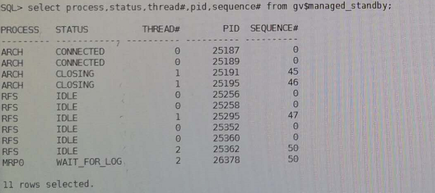
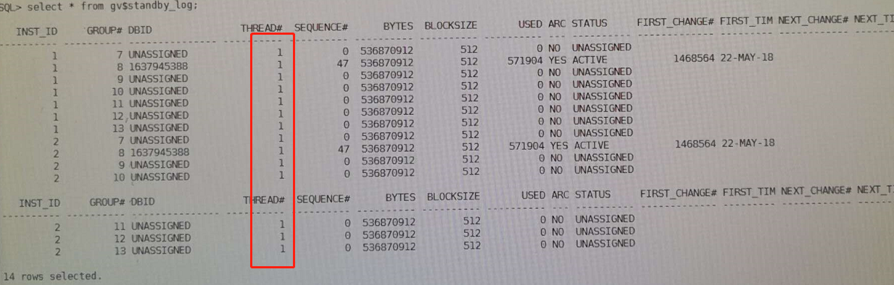

<!-- toc -->

* * * * *
## 一、环境说明
* 主备库均为11gRAC（11.2.0.4）
* 主库为生产环境，同一个数据库上部署了多套实例，故而不能启停监听
* 主备库创建时采用的是policy managed，三个实例其中两个被使用
* 备库因为是RAC环境，为了简化后期的操作步骤，已经在备库创建好了同主库数据库名一致的实例。创建实例时指定db_name、db_unique_name、service_name。在配置过程中只是删除物理文件，其他资源保留。
* 主库的数据文件磁盘组为ORADATA，备库的数据文件磁盘组为DATA
* 基于以上，用最传统是方式进行手工配置

```
主库
192.168.2.220 lowa1
192.168.2.222 lowa2
196.168.2.227 lowa3
196.168.2.229 pri-scan-ip

备库
192.168.66.30 nazeebo1
192.168.66.32 nazeebo2
192.168.66.34 nazeebo3
192.168.66.36 st-scan-ip

vip 和 private ip习惯性忽略
```
>  数据库db_name：jwdlh，主库和备库的db_name一定要相同
> db_unique_name：jwdlhdg，主库和备库的db_unique_name一定要设置成不一样
> service_name：jwdlh，建议主库和备库设置成一样
> 数据文件路径：+DATA
> 归档路径：+ARCH

## 二、主备库网络相关过程
### 1.配置tnsnames
和所有的配置类似，主备库各自在tnsnames.ora中添加对应的tnsname
```
主库：
jwdlh_pri =
  (DESCRIPTION =
    (ADDRESS = (PROTOCOL = TCP)(HOST = 192.168.2.229)(PORT = 11521))
    (CONNECT_DATA =
      (SERVER = DEDICATED)
      (SERVICE_NAME = jwdlh)
    )
  )

备库：
jwdlh_st =
  (DESCRIPTION =
    (ADDRESS = (PROTOCOL = TCP)(HOST = 192.168.66.36)(PORT = 11521))
    (CONNECT_DATA =
      (SERVER = DEDICATED)
      (SERVICE_NAME = jwdlh)
    )
  )
```

### 2.配置监听
因为主库所在的主机上面有其他实例，所以监听不能重启，故而本文采用的方案为动态监听

### 3.测试
在主备库两端各节点执行如下命令：
```
tnsping jwdlh_pri
tnsping jwdlh_st
```
若以上均连接正常，则ok。否则进行troubleshooting，直至网络连接正常。

## 三、主库配置

### 1..确认主库为归档模式
```
archive log list;
如果不是归档模式，那么可以首先将数据库启动到MOUNT状态，然后执行：
ALTER DATABASE ARCHIVELOG
```
### 2.将主库置为Force Logging 模式，在一个节点操作即可
```
 SELECT FORCE_LOGGING  FROM V$DATABASE ;
 ALTER  DATABASE  FORCE  LOGGING;
```

### 3.打开最小补充日志
```
alter database add supplemental log data ;
select supplemental_log_data_min min from v$database ;
```

### 4.配置主库的初始化参数，在一个节点操作即可
```
alter system set fal_client='jwdlh_pri' ;
alter system set fal_server='jwdlh_st' ;
alter system set log_archive_dest_2='service=jwdlh_st lgwr async valid_for=(online_logfiles,primary_role) db_unique_name=jwdlhdg' ;  --这里的db_unique_name设置为备库的
alter system set log_archive_dest_state_1='ENABLE';
alter system set log_archive_dest_state_2='ENABLE';
alter system set standby_file_management='AUTO';
alter system set db_file_name_convert='+DATA/jwdlhdg','+ORADATA/jwdlh','+ARCH/jwdlhdg','+ARCH/jwdlh' scope=spfile;
alter system set log_file_name_convert='+DATA/jwdlhdg','+ORADATA/jwdlh','+ARCH/jwdlhdg','+ARCH/jwdlh' scope=spfile;
```

### 5.创建standby redolog
推荐组数为(每线程的日志组数+1) X 最大线程数，大小和redo一致)：
```
alter database add standby logfile thread 1 group 7  ('+ORADATA','+ARCH') size 512M;
alter database add standby logfile thread 1 group 8   ('+ORADATA','+ARCH') size 512M;
alter database add standby logfile thread 1 group 9  ('+ORADATA','+ARCH') size 512M;
alter database add standby logfile thread 1 group 10 ('+ORADATA','+ARCH') size 512M;
alter database add standby logfile thread 1 group 11 ('+ORADATA','+ARCH') size 512M;
alter database add standby logfile thread 1 group 12 ('+ORADATA','+ARCH') size 512M;
alter database add standby logfile thread 1 group 13 ('+ORADATA','+ARCH') size 512M;
alter database add standby logfile thread 2 group 14 ('+ORADATA','+ARCH') size 512M;
alter database add standby logfile thread 2 group 15 ('+ORADATA','+ARCH') size 512M;
alter database add standby logfile thread 2 group 16 ('+ORADATA','+ARCH') size 512M;
alter database add standby logfile thread 2 group 17 ('+ORADATA','+ARCH') size 512M;
alter database add standby logfile thread 2 group 18 ('+ORADATA','+ARCH') size 512M;
alter database add standby logfile thread 2 group 19 ('+ORADATA','+ARCH') size 512M;
alter database add standby logfile thread 2 group 20 ('+ORADATA','+ARCH') size 512M;
```

### 6.传送密钥文件
用oracle用户传送密钥文件，在一个节点操作即可
```
scp $ORACLE_HOME/dbs/orapwjwdlh oracle@192.168.66.30:/u01/app/oracle/product/11.2.0/db/dbs/orapwjwdlhdg
scp $ORACLE_HOME/dbs/orapwjwdlh oracle@192.168.66.32:/u01/app/oracle/product/11.2.0/db/dbs/orapwjwdlhdg
scp $ORACLE_HOME/dbs/orapwjwdlh oracle@192.168.66.34:/u01/app/oracle/product/11.2.0/db/dbs/orapwjwdlhdg
```
## 四、备库配置过程

### 1.参数配置
```
alter system set fal_client='jwdlh_pri';
alter system set fal_server='jwdlh_st';
alter system set log_archive_dest_2='service=jwdlh_pri lgwr async valid_for=(online_logfiles,primary_role)
db_unique_name=jwdlh' ;  --这里的db_unique_name设置为主库的
alter system set log_archive_dest_state_1='ENABLE';
alter system set log_archive_dest_state_2='DEFER';
alter system set standby_file_management='AUTO';
alter system set db_file_name_convert='+ORADATA/jwdlh','+DATA/jwdlhdg','+ARCH/jwdlh','+ARCH/jwdlhdg' scope=spfile;
alter system set log_file_name_convert='+ORADATA/jwdlh','+DATA/jwdlhdg','+ARCH/jwdlh','+ARCH/jwdlhdg' scope=spfile;
```

### 2.备库删除文件
由于备库当前已经创建了jwdlhdg的数据库，为了避免后期的各种服务注册，利用已经存在的jwdlhdg数据库，只是删除物理文件，其他资源保留。
```
srvctl stop database -d jwdlhdg
asmcmd
ASMCMD>cd +data/jwdlhdg
ASMCMD>rm -rf datafile
ASMCMD>rm -rf controlfile
ASMCMD>rm -rf tempfile
ASMCMD>rm -rf archivelog
ASMCMD>rm -rf onlinelog
```

> 千万注意不要把里面的spfilexxx.ora给删除了！
> 因为里面记录了之前备库所有的修改的初始化参数的信息。

## 五、主库备份
### 1.主库备份数据和归档文件
```
rman target /
rman> sql' alter system archive log current';
RMAN> backup database format '/home/oracle/temp/full_%U';
RMAN> sql' alter system archive log current';
RMAN> backup archivelog all format '/home/oracle/temp/arch_%U';
```
### 2.主库备份成standby控制文件
```
SQL>alter database create standby controlfile as '/home/oracle/temp/standby.ctl';

传送文件至备库其中一个节点
scp * oracle@192.168.66.30:/home/oracle/temp/
```
## 六、备库还原
在刚刚上传了文件的节点上操作即可
***备库的操作顺序请注意！！！***

### 1.restore 数据库
```
export ORACLE_SID=jwdlhdg_1
rman target /
RMAN>startup nomount
RMAN>restore controlfile from '/home/oracle/temp/standby.ctl';
RMAN>alter database mount;
RMAN>restore database;
```

### 2.关闭备库启动到mount standby
```
SQL>shutdown immediate;
SQL>startup nomount;
SQL>alter database mount standby database;
rman target /
RMAN>recover database;
```

### 3.打开数据库
```
SQL>alter database open;
```

## 七、备库操作
### 1.设置为实时应用主库日志
```
SQL> alter database recover managed standby database using current logfile disconnect from session;
```
### 2.启动另外一个节点
```
grid$ srvctl start instance -d jwdlhdg -i jwdlhdg_2
在这个过程，会自动生成inst_2的redo和standby redo log
```
## 八、测试
在主库进行测试表的创建，看在备库上是否能实时看到。

## 九、部署过程中遇到的问题与解决办法
### 1.一个备库也是RAC环境的经验
> 备库如果也是RAC的话，为了简化后期的操作步骤，可以在备库创建好了同主库数据库名一致的实例。创建实例时指定db_name、db_unique_name、service_name。在配置过程中只是删除物理文件，其他资源保留。
> 备库的所有操作只需要启动一个实例进行操作即可，都执行完成且没有问题后，用grid用户去将第二个实例启动起来即可


### 2.在备库alter database open时，提示缺少某些日志
解决方法：
```
在主库执行：
SELECT THREAD#,  MAX (SEQUENCE#)  AS "LAST_APPLIED_LOG" FROM GV$LOG_HISTORY  GROUP  BY THREAD#;
1   12
2   15

在备库执行：
SELECT THREAD#,  MAX (SEQUENCE#)  AS "LAST_APPLIED_LOG" FROM GV$LOG_HISTORY  GROUP  BY THREAD#;
1   10
2   13
```
出现上述的情况时，需要手动将主库thread 1线程的10到12号和thread 2线程的13-15号日志复制到备库，可以参考以下方法，主库使用grid操作：
```
grid$ asmcmd
ASMCMD>cd +arch/jwdlh/archivelog
ASMCMD>cp thread_1_12_376279112.log /home/oracle/temp
ASMCMD>依次将所有缺少的日志复制出来
将复制出来的日志上传至备库
scp *.log oracle@192.168.66.30:/home/oracle/temp/
备库上进行以下操作
SQL>ALTER  DATABASE  REGISTER  LOGFILE '/home/oracle/temp/thread_1_12_376279112.log';
依次将缺少的日志注册进来，在open备库
SQL>alter database open;
```

### 3.备库可以启动并打开，但无法接受主库的日志
```
select status,error from v$archive_dest where dest_name='LOG_ARCHIVE_DEST_2';
查看报错信息，根据提示解决问题，直到status值为VALID

如：ORA-16047: 目标设置和备用之间的 DGID 不匹配；
看主库log_archive_dest_2参数设置，db_unique_name属性和standby的初始化参数db_unique_name是否一致
查看备库的log_archive_config有没有设置
如：ORA-16191: Primary log shipping client not logged on standby
查看这个参数remote_login_passwordfile是否为EXCLUSIVE；
确认备库的密码文件是否来自主库，可以尝试重新将主库的密码文件传送到备库
```

### 4.第一次配置的时候，发现每次要在主库切一次日志，备库才能同步过去
```
用以下命令查看
set lines 200
col ctime format a20
col value format a20
select inst_id,to_char(sysdate,'yyyymmdd hh24:mi:ss') ctime,name,value,datum_time from gv$dataguard_stats where name like '%lag';
```
第一次发现没有lag

在主库重新执行一次``` alter system archive log current;``` 后，发现有了lag


接着查mrp进程，进程是有的：

接着去看standby redo log，发现了问题：

观察上图的结果，发现standby redo log全部都是线程1的，赶紧通过命令把thread 2的standby log补上，过了一会儿就同步了。
```
类似命令：
alter database add standby logfile thread 2 group 14 ('+ORADATA','+ARCH') size 512M;
alter database add standby logfile thread 2 group 15 ('+ORADATA','+ARCH') size 512M;
alter database add standby logfile thread 2 group 16 ('+ORADATA','+ARCH') size 512M;
alter database add standby logfile thread 2 group 17 ('+ORADATA','+ARCH') size 512M;
alter database add standby logfile thread 2 group 18 ('+ORADATA','+ARCH') size 512M;
alter database add standby logfile thread 2 group 19 ('+ORADATA','+ARCH') size 512M;
alter database add standby logfile thread 2 group 20 ('+ORADATA','+ARCH') size 512M;
```

### 5.当归档无法传递时，可在主库尝试执行（这样可达到重新连接的目的）
```
ALTER  SYSTEM  SET  LOG_ARCHIVE_DEST_STATE_2=defer;
ALTER  SYSTEM  SET  LOG_ARCHIVE_DEST_STATE_2=ENABLE;
```

## 十、常用命令
```
---查看备库缺少的归档日志，备库上查看
select thread#, low_sequence#, high_sequence#  from gv$archive_gap;

--手动切换日志
alter  system switch logfile;

--每个实例的日志都切换
alter system archive log current；

--延迟10分钟应用归档
alter database recover managed standby database delay 10 disconnect from session;

--取消延迟
alter database recover managed standby database nodelay  disconnect from session;

--使用standby redolog应用日志，这样可以实时接受主库日志
alter database recover managed standby database using current logfile disconnect from session;

--取消日志应用
alter  database  recover managed standby  database  cancel;

--使用归档日志应用日志，这种方式为10g的方式，只能等主库日志切换时才可以接受并应用主库的归档日志
alter  database  recover managed standby  database  disconnect from session;

--查看主库归档传送和应用情况
select dest_name,archived_thread#,archived_seq#, applied_thread#,applied_seq#, db_unique_name  from gv$archive_dest_status  where  status= 'valid';

--查看主备库的日志的应用情况是否一致
select thread#,  max (sequence#)  as "last_applied_log" from gv$log_history  group  by thread#;

--查看dg各进程信息
select process,status,thread#,pid,sequence# from gv$managed_standby;

--查看standby日志状态
select * from gv$standby_log;

--在备库上查看日志传递和应用是否有lag
set lines 200
col ctime format a20
col value format a20
select inst_id,to_char(sysdate,'yyyymmdd hh24:mi:ss') ctime,name,value,datum_time from gv$dataguard_stats where name like '%lag';
```
