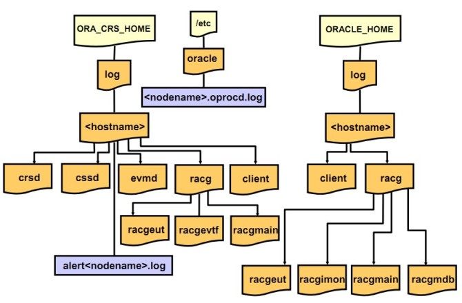

Oracle集群环境中日志体系结构，在遇到问题时，可以快速查找所需的日志文件，及时的定位问题~
1.Oracle集群日志的文件路径
Oracle集群涉及的日志主要位于“$GRID_HOME/log”和“$ORACLE_HOME/log”目录中。
2.日志目录结构
clusterware 层的日志结构：
grid@rac1:/home/grid>tree -d $ORACLE_HOME/log
/opt/rac/11.2.0/grid/log
|-- crs
|-- diag
|   `-- clients
|       `-- user_root
|           `-- host_1874443374_76
|               |-- alert
|               |-- cdump
|               |-- incident
|               |-- incpkg
|               |-- lck
|               |-- metadata
|               |-- stage
|               |-- sweep
|               `-- trace
`-- rac1
    |-- admin
    |-- agent
    |   |-- crsd
    |   |   |-- oraagent_grid
    |   |   |-- oraagent_oracle
    |   |   `-- orarootagent_root
    |   `-- ohasd
    |       |-- oraagent_grid
    |       |-- oracssdagent_root
    |       |-- oracssdmonitor_root
    |       `-- orarootagent_root
    |-- client
    |-- crsd
    |-- cssd
    |-- ctssd
    |-- diskmon
    |-- evmd
    |-- gipcd
    |-- gnsd
    |-- gpnpd
    |-- mdnsd
    |-- ohasd
    |-- racg
    |   |-- racgeut
    |   |-- racgevtf
    |   `-- racgmain
    `-- srvm

42 directories
RMDBS 层的日志结构：
oracle@rac1:/opt/rac/oracle/diag/rdbms/rac>tree -d rac1
rac1
|-- alert
|-- cdump
|-- hm
|-- incident
|-- incpkg
|-- ir
|-- lck
|-- metadata
|-- stage
|-- sweep
`-- trace
11 directories

其中“rac1”是主机名。

3.日志目录功能说明
1）CRS日志存放在“$GRID_HOME/log//crsd”目录，系统会对该日志每10M进行归档一次；
2）CSS日志存放在“$GRID_HOME/log//cssd”目录，系统会对该日志每20M进行归档一次；
3）EVM日志存放在“$GRID_HOME/log//evmd”目录；
4）“$GRID_HOME/log/”和“$ORACLE_HOME/log/”目录中的racg目录中记录了RACG可执行文件对应的日志；
5）“$GRID_HOME/log//client”和“$ORACLE_HOME/log//client”目录记录了与srvctl、ocrdump、ocrconfig以及ocrcheck命令对应的日志信息。

4.Oracle集群的alert日志
Oracle RAC环境中的alert日志文件与Oracle单实例的alert日志一样。该文件位于“在 $ORACLE_BASE/rdbms//trace”目录下，命名规则为“alert_.log”
该警告日志记录了有关Oracle集群rdbms 层面的重要警告信息。
oracle@rac1:/opt/rac/oracle/diag/rdbms/rac/rac1/trace>more alert_rac1.log 
Starting up:
Oracle Database 11g Enterprise Edition Release 11.2.0.1.0 - 64bit Production
With the Partitioning, Real Application Clusters, OLAP, Data Mining
and Real Application Testing options.
Using parameter settings in client-side pfile /opt/rac/oracle/admin/rac/pfile/init.ora on machine rac1
System parameters with non-default values:
  processes                = 150
  nls_language             = "SIMPLIFIED CHINESE"
  nls_territory            = "CHINA"
  memory_target            = 1584M
  control_files            = "+DATA2/rac/controlfile/current.260.781821965"
  db_block_size            = 8192
  compatible               = "11.2.0.0.0"
  log_archive_dest_1       = "LOCATION=+DATA2"
  log_archive_format       = "yangdb_%t_%s_%r.dbf"
  db_create_file_dest      = "+DATA2"
  undo_tablespace          = "UNDOTBS1"
  instance_number          = 1
  remote_login_passwordfile= "EXCLUSIVE"
  db_domain                = ""
  dispatchers              = "(PROTOCOL=TCP) (SERVICE=racXDB)"
  remote_listener          = "scan:1521"
  audit_file_dest          = "/opt/rac/oracle/admin/rac/adump"
  audit_trail              = "DB"
  db_name                  = "rac"
  open_cursors             = 300
  diagnostic_dest          = "/opt/rac/oracle"
Cluster communication is configured to use the following interface(s) for this instance
  10.10.10.10
cluster interconnect IPC version:Oracle UDP/IP (generic)
IPC Vendor 1 proto 2
Sat Apr 28 20:50:38 2012
PMON started with pid=2, OS id=16042 
Sat Apr 28 20:50:38 2012
VKTM started with pid=3, OS id=16044 at elevated priority
VKTM running at (10)millisec precision with DBRM quantum (100)ms
Sat Apr 28 20:50:39 2012
GEN0 started with pid=4, OS id=16048 
Sat Apr 28 20:50:39 2012
DIAG started with pid=5, OS id=16050 
Sat Apr 28 20:50:39 2012
DBRM started with pid=6, OS id=16052 
5.小结
熟悉Oracle集群环境下日志文件的位置和功能有助于快速定位故障的位置，善用之。

ORA-29780: unable to connect GPnP daemon [CLSGPNP_ERR]
 
安装完成 11GR2 Grid 之后，使用asmca创建磁盘组的时候遇到如下报错：
Started getting following error

ORA-29780: unable to connect to GPnP daemon [CLSGPNP_ERR]
google 一把 和环境变量有关：(CRS/GRID 是运行正常的). 

grid@rac1 /oragrid/dbs> env | grep ORA
GRID_HOME=/opt/11.2.0/grid <====== 从老的bash_profle 中继承的！
ORACLE_SID=+ASM1
ORACLE_BASE=/opt/rac/grid
ORACLE_HOME=/opt/rac/11.2.0/grid
$GRID_HOME变量必须和$ORACLE_HOME 保持一致,否则在使用asmca创建磁盘的时候 会认不到asm 磁盘!
