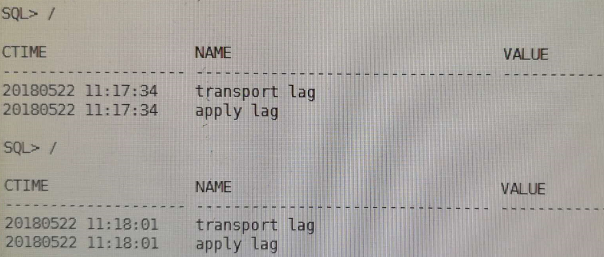
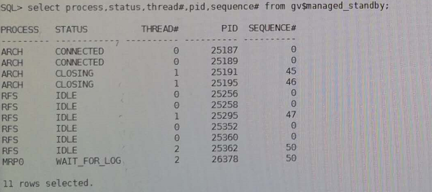

```
用以下命令查看
set lines 200
col ctime format a20
col value format a20
select inst_id,to_char(sysdate,'yyyymmdd hh24:mi:ss') ctime,name,value,datum_time from gv$dataguard_stats where name like '%lag';
```
第一次发现没有lag

在主库重新执行一次``` alter system archive log current;``` 后，发现有了lag


接着查mrp进程，进程是有的：

接着去看standby redo log，发现了问题：

观察上图的结果，发现standby redo log全部都是线程1的，赶紧通过命令把thread 2的standby log补上，过了一会儿就同步了。
```
类似命令：
alter database add standby logfile thread 2 group 14 ('+DATA/','+ARCH') size 512M;
alter database add standby logfile thread 2 group 15 ('+DATA/','+ARCH') size 512M;
alter database add standby logfile thread 2 group 16 ('+DATA/','+ARCH') size 512M;
alter database add standby logfile thread 2 group 17 ('+DATA/','+ARCH') size 512M;
alter database add standby logfile thread 2 group 18 ('+DATA/','+ARCH') size 512M;
alter database add standby logfile thread 2 group 19 ('+DATA/','+ARCH') size 512M;
alter database add standby logfile thread 2 group 20 ('+DATA/','+ARCH') size 512M;
```

```
ARC3: Archivelog destination LOG_ARCHIVE_DEST_2 disabled: Data Guard configuration identifier mismatch
```

在主库上查询v$ARCHIVE_DEST视图：
```
SQL> select dest_name, status, error from v$archive_dest WHERE DEST_ID = 2;

DEST_NAME
--------------------------------------------------------------------------------
STATUS    ERROR
--------- -----------------------------------------------------------------
LOG_ARCHIVE_DEST_2
DISABLED  ORA-16047: DGID mismatch between destination setting and target
          database
```
需要重点检查如下参数：
```
log_archive_config
fal_client
fal_server
log_archive_dest_2
log_archive_dest_state_2
```

=====================================
# DG传输过程监控

## 1、查看备库工作模式及状态
```
select inst_id,db_unique_name,database_role,open_mode,protection_mode,protection_level,switchover_status,force_logging from gv$database;
select db_unique_name,protection_mode,synchronization_status,SYNCHRONIZED from v$archive_dest_status;
```

## 2、日志恢复进程
```
archive log list;
select thread#,max(sequence#) from v$archived_log group by thread#;
select pid,process,client_process,client_pid,thread#,sequence#,status,DELAY_MINS from v$managed_standby;
```

--RFS进程从主数据库接收重做数据，并将其写入备用重做日志。

## 3、查看standbylog状态
如果是RAC两节点，那么每个节点至少有一个是ACTIVE的状态，否则不对
```
set lines 200
select group#,thread#,sequence#,bytes/1024/1024,archived,used,status,first_change#,last_change# from v$standby_log;
```

检查备库已恢复的最大归档日志序号
```
select thread#,max(sequence#),registrar,applied,status from v$archived_log where applied='YES' and registrar='RFS' and name is not null group by thread#,registrar,applied,status;
```

## 4、检查应用率和活动率（PS）
--Redo Applied 值以MB衡量。剩余两个以KB/s计算。
```
select to_char(start_time,'DD-MON-RR HH24:MI:SS') start_time,ITEM,sofar
from v$recovery_progress
where item in ('Active Apply Rate','Average Apply Rate','Redo Applied');
```

## 5、审阅传输和应用滞后（PS+LS）

- transport lag 表明从主数据库到物理备用数据库的重做数据传输时间。
- apply lag 表明应用滞后时间，它反映了archive_log_dest_n参数中 DELAY 特性。

```
COL NAME FOR A13
COL VALUE FOR A20
COL UNIT FOR A30
SET LINES 200
select name,value,unit,time_computed from v$dataguard_stats
where name like '%lag%';
```

## 6、查看Data Guard状态视图中的错误
```
set lines 132
col message for a80
col timestamp for a20
select error_code,severity,message,
to_char(timestamp,'DD-MON-RR HH24:MI:SS') timestamp
from v$dataguard_status
where callout='YES'
and timestamp > sysdate -1;
```

## 7、检查日志文件是否传输到备用数据库
```
select dest_name,status,error from v$archive_dest where dest_id=2;
DEST_NAME STATUS ERROR
-------------------- ---------- --------------------
LOG_ARCHIVE_DEST_2 VALID
```
status列如果为valid，说明归档成功，可以查看error列得到不能归档的原因
