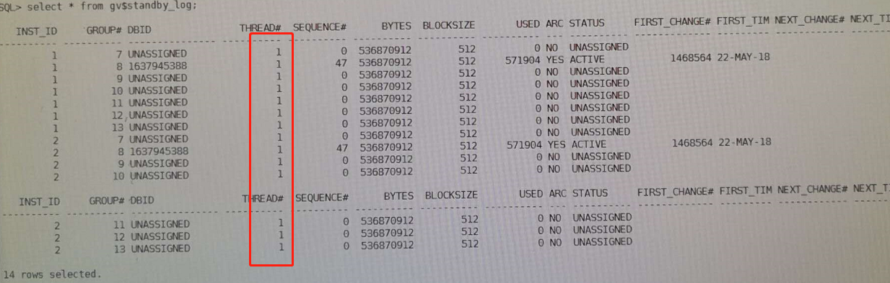

```
用以下命令查看
set lines 200
col ctime format a20
col value format a20
select inst_id,to_char(sysdate,'yyyymmdd hh24:mi:ss') ctime,name,value,datum_time from gv$dataguard_stats where name like '%lag';
```
第一次发现没有lag

在主库重新执行一次``` alter system archive log current;``` 后，发现有了lag


接着查mrp进程，进程是有的：

接着去看standby redo log，发现了问题：

观察上图的结果，发现standby redo log全部都是线程1的，赶紧通过命令把thread 2的standby log补上，过了一会儿就同步了。
```
类似命令：
alter database add standby logfile thread 2 group 14 ('+DATA/','+ARCH') size 512M;
alter database add standby logfile thread 2 group 15 ('+DATA/','+ARCH') size 512M;
alter database add standby logfile thread 2 group 16 ('+DATA/','+ARCH') size 512M;
alter database add standby logfile thread 2 group 17 ('+DATA/','+ARCH') size 512M;
alter database add standby logfile thread 2 group 18 ('+DATA/','+ARCH') size 512M;
alter database add standby logfile thread 2 group 19 ('+DATA/','+ARCH') size 512M;
alter database add standby logfile thread 2 group 20 ('+DATA/','+ARCH') size 512M;
```
