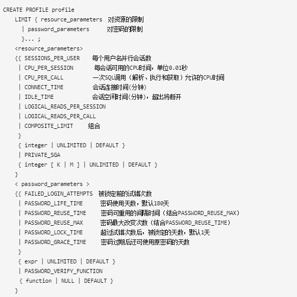

<!-- toc -->

* * * * * *

# 创建用户profile
## 创建密码复杂度校验函数
```
sqlplus / as sysdba
SQL> @?/rdbms/admin/utlpwdmg.sql
```

## 创建profile
### 语法树



### 选项说明
#### profile部分
- profile：配置文件的名称。Oracle数据库以以下方式强迫资源限制：
  - 如果用户超过了connect_time或idle_time的会话资源限制，数据库就回滚当前事务，并结束会话。用户再次执行命令，数据库则返回一个错误
  - 如果用户试图执行超过其他的会话资源限制的操作，数据库放弃操作，回滚当前事务并立即返回错误。用户之后可以提交或回滚当前事务，必须结束会话。
- Unlimited：分配该profile的用户对资源使用无限制，当使用密码参数时，unlimited意味着没有对参数加限制。
- Default：指定为default意味着忽略对profile中的一些资源限制，Default profile初始定义对资源不限制，可以通过alter profile命令来改变。

#### Resource_parameter部分
- Logical_reads_per_session：每会话允许读的数据块的数目，包括从内存和磁盘读的所有数据块。
- Logical_read_per_call：一次执行SQL（解析、执行和提取）调用允许读的数据块最大数目。
- Private_sga：指定一个会话可以在共享池（SGA）中所允许分配的最大空间，以字节为单位。（该限制只在使用共享服务器结构时才有效，会话在SGA中的私有空间包括私有的SQL和PL/SQL，但不包括共享的SQL和PL/SQL）。
- Composite_limit：指定一个会话的总的资源消耗，以service units单位表示。Oracle数据库以有利的方式计算cpu_per_session，connect_time，logical_reads_per_session和private-sga总的service units

#### Password_parameter部分：
- Password_life_time：指定同一密码所允许使用的天数。如果同时指定了password_grace_time参数，如果在grace period内没有改变密码，则密码会失效，连接数据库被拒绝。如果没有设置password_grace_time参数，默认值unlimited将引发一个数据库警告，但是允许用户继续连接。

- Password_reuse_time和password_reuse_max：
  - 这两个参数必须互相关联设置，password_reuse_time指定了密码不能重用前的天数，而password_reuse_max则指定了当前密码被重用之前密码改变的次数。两个参数都必须被设置为整数。
    ```
    1．如果为这两个参数指定了整数，则用户不能重用密码直到密码被改变了password_reuse_max指定的次数以后在password_reuse_time指定的时间内。如：password_reuse_time=30，password_reuse_max=10，用户可以在30天以后重用该密码，要求密码必须被改变超过10次。
    2．如果指定了其中的一个为整数，而另一个为unlimited，则用户永远不能重用一个密码。
    3.．如果指定了其中的一个为default，Oracle数据库使用定义在profile中的默认值，默认情况下，所有的参数在profile中都被设置为unlimited，如果没有改变profile默认值，数据库对该值总是默认为unlimited。
    4．如果两个参数都设置为unlimited，则数据库忽略他们。
    ```

- Password_grace_time：指定宽限天数，数据库发出警告到登陆失效前的天数。如果数据库密码在这中间没有被修改，则过期会失效。
- Password_verify_function：该字段允许将复杂的PL/SQL密码验证脚本做为参数传递到create profile语句。Oracle数据库提供了一个默认的脚本，但是自己可以创建自己的验证规则或使用第三方软件验证。 对Function名称，指定的是密码验证规则的名称，指定为Null则意味着不使用密码验证功能。如果为密码参数指定表达式，则该表达式可以是任意格式，除了数据库标量子查询。

### 示例
```
 CREATE PROFILE my_profile LIMIT
    SESSIONS_PER_USER          UNLIMITED  #对用户的并发连接会话数不做限制
    CPU_PER_SESSION            UNLIMITED  #对于连接到用户的每一个session的CPU时间的使用不做限制
    CPU_PER_CALL               6000       #一次调用消耗的CPU时间不能超过60秒（不超过一分钟）
    CONNECT_TIME               60         #连接到用户的每次会话时间不能超过60分钟（不超过一个小时）
    LOGICAL_READS_PER_SESSION  DEFAULT    #一次会话使用的物理读与逻辑读数据块总量与DEFAULT profile中定义保持一致
    LOGICAL_READS_PER_CALL     60000      #一次调用使用的物理读与逻辑读数据块总量不超过60000个数据块
    COMPOSITE_LIMIT            6000000    #一次会话总的资源消耗不超过6000000个服务单元（service units）
    FAILED_LOGIN_ATTEMPTS      10         #帐户被锁定之前允许10次的错误尝试
    PASSWORD_LIFE_TIME         UNLIMITED  #密码不过期
    PASSWORD_REUSE_TIME        UNLIMITED  #密码重置时间不限制
    PASSWORD_LOCK_TIME         1/24       #超过错误尝试次数后，用户将被锁定1小时
    PASSWORD_GRACE_TIME        10         #当密码过期之后原密码还可以使用10天
    PASSWORD_VERIFY_FUNCTION   verify_function #使用密码复杂度校验函数verify_function对密码做检查
/
```

## profile后续操作
### 查看创建的profile
```
select * from dba_profiles;
```

### 将profile文件分配给用户
```
SQL> alter user scott profile my_profile;
SQL> select USERNAME,PROFILE from dba_users where USERNAME = 'scott';
SQL> alter user scott profile default;
SQL> select USERNAME,PROFILE from dba_users where USERNAME = 'scott';
```

### profile生效
- PROFILE中有关密码的限制永远生效，不受限制。
- PROFILE中有关资源的限制与resource_limit参数的设置有关，为TRUE时生效，为FALSE时(默认)无效。

## 用户密码过期问题
11g之前版本，默认用户没有密码过期限制，在Oracle 11g 中默认 profile 密码过期时间是180天。
```
select * from dba_profiles where profile='DEFAULT' and resource_name='PASSWORD_LIFE_TIME';
```

过期的密码可用 `alter user userXXX identified by xxx;` 解决，可修改为和以前一样。
如果想设置密码不过期，可用管理员登陆，执行下面命令：
```
ALTER PROFILE DEFAULT LIMIT PASSWORD_LIFE_TIME UNLIMITED;
```
