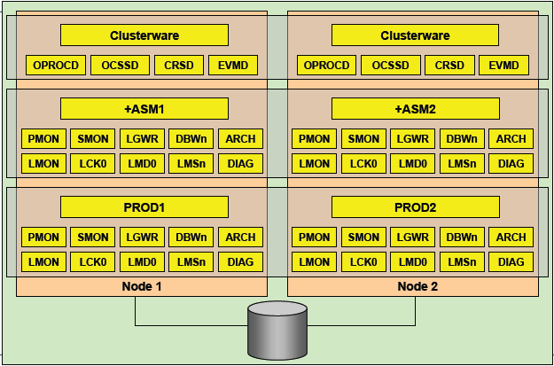

<!-- toc -->

* * * * *

## 一、RAC后台进程
### 1. LMON
LMON:LOCK Monitor Processes 也被称为Global enqueue service monitor
*   监控整个集群状况，维护GCS的内存结构
*   监控非正常终止的进程和实例
*   当实例离开和加入集群时，锁和资源的重新配置
*   管理全局的锁和资源
*   监控全局的锁资源、处理死锁和阻塞

### 2. LMSn:Lock Monitor Services
也称作GCS（Global Cache Services）processes
LMS进程主要用来管理集群内数据库的访问，并在不同实例的buffer cache中传输块镜像，当在某个数据块上

发生一致性读时，LMS负责回滚该数据块，并将它copy到请求的实例上
每个RAC节点至少有2个LMS进程

### 3.  LCK:Lock Process
LCK进程主要用来管理实例间资源请求和跨实例调用操作，调用操作包括数据字典等对像访问，并处理非

CACEH FUSION的CHACE资源请求，（例如dictionary cache或row cache的请求）
由于LMS进程负责主要的锁管理功能，所以每个实例只有一个LCK进程

### 4. LMD:Lock Monitor Deamon Process
LMD进程主要管理对全局队列和资源的访问，并更新相应队列状态，处理来自于其它实例的资源请，每一个全局队列的当前状态存储在相应的实例共享内存中，该状态表明该实例具有相应的权利使用该资源，一个实例master的共享内存中存在一个特殊的队列，该队列记录来自其它远程实例的资源请求，当远程实例的LMD进程发出一个资源请求时，该请求指向master实例的LMD，当master实例的LMD进程受到该请求后，在共享内存中的特殊队列中监测该资源是否有无效，如果有效LMD进程更新该资源对列的状态，并通知请求资源的LMD进程该资源队列可以使用了，如果资源队列正被其它实例使用或当前无效，则LMD进程通知正在使用中的实例的LMD进程应用释放该资源，等资源释放变得有效时，master实例的LMD进程更新该资源队列的状态，并通知请求资源实例的LMD进程，该资源队列可以使用了

### 5. DIAG:Diagnostic Deamon
  oracle10g新的后台进程
  例行对实例的健康情况进行监控，同时也监控实例是否挂起或者出现死锁
  收集实例和进程出错时的关键诊断信息
  这个进程会更新alert日志文件，写入一些重要告警信息
## 二、RAC服务进程
### 1. CRS-集群资源服务(cluster ready services)
* 管理集群内高可用操作的基本程序
* CRS管理的任何事务被称之为资源
* 数据库、实例、监听、虚拟IP、应用进程等等
* CRS是跟据存储于OCR中的资源配置信息来管理这些资源
* 当一资源的状态改变时，CRS进程生成一个事件

### 2. CSS-集群同步服务(Cluster Synchronization Service)
* 管理集群节点的成员资格
* 控制哪 个结点为集群的成员、节点在加入或离开集群时通知集群成员来控制集群配置信息
* 此进程发生故障导致集群重启

### 3. EVMD事件管理服务(Event Management)
* 事件管理守护进程
* 发布CRS创建事件的后台进程

### 4. ONS-事件的发布及订阅服务(Oracle Notification Service)
* 通信的快速应用通知事件的发布及订阅服务

### 5. OCR- Oracle Cluster Register
* 集群注册文件，记录每个节点的相关信息
* 保存RAC集群的各种资源信息
* 类似于windows注册表
* 存储于共享磁盘上，所有实例共享
* 默认有2个互备磁盘

### 6. Voting Disk 表决磁盘
* 仲裁机制用于仲裁多个节点向共享节点财时写的行为，避免发生冲突
* 存储于共享磁盘上，所有实例共享
* 用于确定各个实例的关系
* 当有节点失效时，通过voting disk来决定驱逐哪个实例
* 默认有3个互备磁盘
