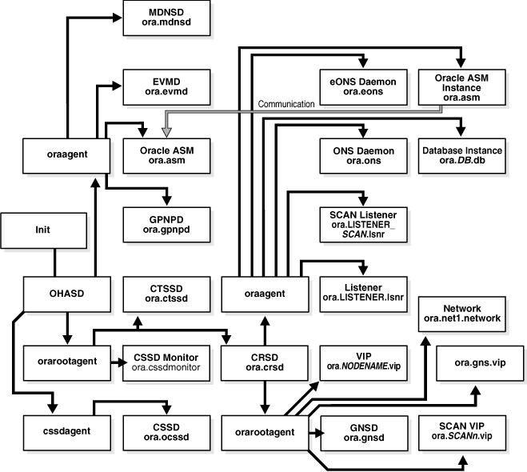

# crs/has/cluster的关系

The Oracle Clusterware Stack

Oracle Clusterware consists of two separate stacks: an upper stack anchored by the Cluster Ready Services (CRS) daemon (crsd) and a lower stack anchored by the Oracle High Availability Services daemon (ohasd). These two stacks have several processes that facilitate cluster operations. The following sections describe these stacks in more detail:
The Cluster Ready Services Stack
The Oracle High Availability Services Stack

The Cluster Ready Services Stack
The list in this section describes the processes that comprise CRS. The list includes components that are processes on Linux and UNIX operating systems, or services on Windows.
Cluster Ready Services (CRS): The primary program for managing high availability operations in a cluster.
The CRS daemon (crsd) manages cluster resources based on the configuration information that is stored in OCR for each resource. This includes start, stop, monitor, and failover operations. The crsd process generates events when the status of a resource changes. When you have Oracle RAC installed, the crsd process monitors the Oracle database instance, listener, and so on, and automatically restarts these components when a failure occurs.
Cluster Synchronization Services (CSS): Manages the cluster configuration by controlling which nodes are members of the cluster and by notifying members when a node joins or leaves the cluster. If you are using certified third-party clusterware, then CSS processes interfaces with your clusterware to manage node membership information.
The cssdagent process monitors the cluster and provides I/O fencing. This service formerly was provided by Oracle Process Monitor Daemon (oprocd), also known as OraFenceService on Windows. A cssdagent failure results in Oracle Clusterware restarting the node.
Oracle ASM: Provides disk management for Oracle Clusterware.
Cluster Time Synchronization Service (CTSS): Provides time management in a cluster for Oracle Clusterware.
Event Management (EVM): A background process that publishes events that Oracle Clusterware creates.
Oracle Notification Service (ONS): A publish and subscribe service for communicating Fast Application Notification (FAN) events.
Oracle Agent (oraagent): Extends clusterware to support Oracle-specific requirements and complex resources. Runs server callout scripts when FAN events occur. This process was known as RACG in Oracle Clusterware 11g release 1 (11.1).
Oracle Root Agent (orarootagent): A specialized oraagent process that helps crsd manage resources owned by root, such as the network, and the Grid virtual IP address.

The Cluster Synchronization Service (CSS), Event Management (EVM), and Oracle Notification Services (ONS) components communicate with other cluster component layers in the other instances in the same cluster database environment. These components are also the main communication links between Oracle Database, applications, and the Oracle Clusterware high availability components. In addition, these background processes monitor and manage database operations.

The Oracle High Availability Services Stack

The list in this section describes the processes that comprise the Oracle High Availability Services stack. The list includes components that are processes on Linux and UNIX operating systems, or services on Windows.

Grid Plug and Play (gpnpd): GPNPD provides access to the Grid Plug and Play profile, and coordinates updates to the profile among the nodes of the cluster to ensure that all of the nodes node have the most recent profile.
Grid Interprocess Communication (GIPC): A helper daemon for the communications infrastructure. Currently has no functionality; to be activated in a later release.
Multicast Domain Name Service (mDNS): Allows DNS requests. The mDNS process is a background process on Linux and UNIX, and a service on Windows.
Oracle Grid Naming Service (GNS): A gateway between the cluster mDNS and external DNS servers. The gnsd process performs name resolution within the cluster.

Table 1-1 lists the processes and services associated with Oracle Clusterware components. In Table 1-1, if a UNIX or a Linux system process has an (r) beside it, then the process runs as the root user.
Table 1-1 List of Processes and Services Associated with Oracle Clusterware Components
Oracle Clusterware Component
Linux/UNIX Process
Windows Services
Windows Processes
CRS
crsd.bin (r)
OracleHAService
crsd.exe
CSS
ocssd.bin, cssdmonitor, cssdagent
OracleHAService
cssdagent.exe, cssdmonitor.exeocssd.exe
CTSS
octssd.bin (r)

EVM
evmd.bin, evmlogger.bin
OracleHAService
evmd.exe
GIPC
gipcd.bin

GNS
gnsd (r)

gnsd.exe
Grid Plug and Play
gpnpd.bin
OracleHAService
gpnpd.exe
Master Diskmon
diskmon.bin

mDNS
mdnsd.bin
mDNSResponder
mdns.exe
Oracle agent
oraagent.bin (11.2), or racgmain and racgimon(11.1)

oraagent.exe
Oracle High Availability Services
ohasd.bin (r)
OracleHAService
ohasd.exe
ONS
ons

ons.exe
Oracle root agent
orarootagent (r)

1 通过命令查看cluster/has/crs管理的内容
[root@11rac1 ~]# crsctl check crs
CRS-4638: Oracle High Availability Services is online
CRS-4537: Cluster Ready Services is online
CRS-4529: Cluster Synchronization Services is online
CRS-4533: Event Manager is online
[root@11rac1 ~]# crsctl check has
CRS-4638: Oracle High Availability Services is online
[root@11rac1 ~]# crsctl check cluster
CRS-4537: Cluster Ready Services is online
CRS-4529: Cluster Synchronization Services is online
CRS-4533: Event Manager is online
这里可以看到crs显示的内容=has+cluster显示的内容
2 分别执行3条命令查看结果显示
2.1 crsctl stop cluster
root@11rac1 ~]# crsctl stop cluster
CRS-2673: Attempting to stop ‘ora.crsd’ on ’11rac1′
CRS-2790: Starting shutdown of Cluster Ready Services-managed resources on ’11rac1′
CRS-2673: Attempting to stop ‘ora.LISTENER.lsnr’ on ’11rac1′
CRS-2673: Attempting to stop ‘ora.LISTENER_SCAN1.lsnr’ on ’11rac1′
CRS-2673: Attempting to stop ‘ora.CRS.dg’ on ’11rac1′
CRS-2673: Attempting to stop ‘ora.power.db’ on ’11rac1′
CRS-2677: Stop of ‘ora.LISTENER.lsnr’ on ’11rac1′ succeeded
CRS-2673: Attempting to stop ‘ora.11rac1.vip’ on ’11rac1′
CRS-2677: Stop of ‘ora.LISTENER_SCAN1.lsnr’ on ’11rac1′ succeeded
CRS-2673: Attempting to stop ‘ora.scan1.vip’ on ’11rac1′
CRS-2677: Stop of ‘ora.scan1.vip’ on ’11rac1′ succeeded
CRS-2672: Attempting to start ‘ora.scan1.vip’ on ’11rac2′
CRS-2677: Stop of ‘ora.11rac1.vip’ on ’11rac1′ succeeded
CRS-2672: Attempting to start ‘ora.11rac1.vip’ on ’11rac2′
CRS-2677: Stop of ‘ora.power.db’ on ’11rac1′ succeeded
CRS-2673: Attempting to stop ‘ora.DATA.dg’ on ’11rac1′
CRS-2676: Start of ‘ora.11rac1.vip’ on ’11rac2′ succeeded
CRS-2676: Start of ‘ora.scan1.vip’ on ’11rac2′ succeeded
CRS-2672: Attempting to start ‘ora.LISTENER_SCAN1.lsnr’ on ’11rac2′
CRS-2677: Stop of ‘ora.DATA.dg’ on ’11rac1′ succeeded
CRS-2676: Start of ‘ora.LISTENER_SCAN1.lsnr’ on ’11rac2′ succeeded
CRS-2677: Stop of ‘ora.CRS.dg’ on ’11rac1′ succeeded
CRS-2673: Attempting to stop ‘ora.asm’ on ’11rac1′
CRS-2677: Stop of ‘ora.asm’ on ’11rac1′ succeeded
CRS-2673: Attempting to stop ‘ora.ons’ on ’11rac1′
CRS-2677: Stop of ‘ora.ons’ on ’11rac1′ succeeded
CRS-2673: Attempting to stop ‘ora.net1.network’ on ’11rac1′
CRS-2677: Stop of ‘ora.net1.network’ on ’11rac1′ succeeded
CRS-2792: Shutdown of Cluster Ready Services-managed resources on ’11rac1′ has completed
CRS-2677: Stop of ‘ora.crsd’ on ’11rac1′ succeeded
CRS-2673: Attempting to stop ‘ora.ctssd’ on ’11rac1′
CRS-2673: Attempting to stop ‘ora.evmd’ on ’11rac1′
CRS-2673: Attempting to stop ‘ora.asm’ on ’11rac1′
CRS-2677: Stop of ‘ora.evmd’ on ’11rac1′ succeeded
CRS-2677: Stop of ‘ora.ctssd’ on ’11rac1′ succeeded
CRS-2677: Stop of ‘ora.asm’ on ’11rac1′ succeeded
CRS-2673: Attempting to stop ‘ora.cluster_interconnect.haip’ on ’11rac1′
CRS-2677: Stop of ‘ora.cluster_interconnect.haip’ on ’11rac1′ succeeded
CRS-2673: Attempting to stop ‘ora.cssd’ on ’11rac1′
CRS-2677: Stop of ‘ora.cssd’ on ’11rac1′ succeeded

[root@11rac1 ~]# crsctl check crs
CRS-4638: Oracle High Availability Services is online
CRS-4535: Cannot communicate with Cluster Ready Services
CRS-4530: Communications failure contacting Cluster Synchronization Services daemon
CRS-4534: Cannot communicate with Event Manager

[root@11rac1 ~]# crsctl check has
CRS-4638: Oracle High Availability Services is online

[root@11rac1 ~]# crsctl check cluster
CRS-4535: Cannot communicate with Cluster Ready Services
CRS-4530: Communications failure contacting Cluster Synchronization Services daemon
CRS-4534: Cannot communicate with Event Manager
这里可以看到stop cluster停了Clusterware stack，其实也就是官方文档中指的Cluster Ready Services Stack。
2.2 crsctl stop has
继续上面的操作
[root@11rac1 ~]# crsctl stop has
CRS-2791: Starting shutdown of Oracle High Availability Services-managed resources on ’11rac1′
CRS-2673: Attempting to stop ‘ora.mdnsd’ on ’11rac1′
CRS-2673: Attempting to stop ‘ora.crf’ on ’11rac1′
CRS-2677: Stop of ‘ora.crf’ on ’11rac1′ succeeded
CRS-2673: Attempting to stop ‘ora.gipcd’ on ’11rac1′
CRS-2677: Stop of ‘ora.mdnsd’ on ’11rac1′ succeeded
CRS-2677: Stop of ‘ora.gipcd’ on ’11rac1′ succeeded
CRS-2673: Attempting to stop ‘ora.gpnpd’ on ’11rac1′
CRS-2677: Stop of ‘ora.gpnpd’ on ’11rac1′ succeeded
CRS-2793: Shutdown of Oracle High Availability Services-managed resources on ’11rac1′ has completed
CRS-4133: Oracle High Availability Services has been stopped.

stop has停的就是官方文档中的Oracle High Availability Services Stack，但是Oracle High Availability Services Stack属于Cluster Ready Services Stack依赖的底层，所以在停Oracle High Availability Services Stack会自动停Cluster Ready Services Stack，如下：

[root@11rac1 ~]# crsctl stop has
CRS-2791: Starting shutdown of Oracle High Availability Services-managed resources on ’11rac1′
CRS-2673: Attempting to stop ‘ora.crsd’ on ’11rac1′
CRS-2790: Starting shutdown of Cluster Ready Services-managed resources on ’11rac1′
CRS-2673: Attempting to stop ‘ora.CRS.dg’ on ’11rac1′
CRS-2673: Attempting to stop ‘ora.power.db’ on ’11rac1′
CRS-2673: Attempting to stop ‘ora.LISTENER.lsnr’ on ’11rac1′
CRS-2677: Stop of ‘ora.LISTENER.lsnr’ on ’11rac1′ succeeded
CRS-2673: Attempting to stop ‘ora.11rac1.vip’ on ’11rac1′
CRS-2677: Stop of ‘ora.11rac1.vip’ on ’11rac1′ succeeded
CRS-2672: Attempting to start ‘ora.11rac1.vip’ on ’11rac2′
CRS-2677: Stop of ‘ora.power.db’ on ’11rac1′ succeeded
CRS-2673: Attempting to stop ‘ora.DATA.dg’ on ’11rac1′
CRS-2676: Start of ‘ora.11rac1.vip’ on ’11rac2′ succeeded
CRS-2677: Stop of ‘ora.DATA.dg’ on ’11rac1′ succeeded
CRS-2677: Stop of ‘ora.CRS.dg’ on ’11rac1′ succeeded
CRS-2673: Attempting to stop ‘ora.asm’ on ’11rac1′
CRS-2677: Stop of ‘ora.asm’ on ’11rac1′ succeeded
CRS-2673: Attempting to stop ‘ora.ons’ on ’11rac1′
CRS-2677: Stop of ‘ora.ons’ on ’11rac1′ succeeded
CRS-2673: Attempting to stop ‘ora.net1.network’ on ’11rac1′
CRS-2677: Stop of ‘ora.net1.network’ on ’11rac1′ succeeded
CRS-2792: Shutdown of Cluster Ready Services-managed resources on ’11rac1′ has completed
CRS-2677: Stop of ‘ora.crsd’ on ’11rac1′ succeeded
CRS-2673: Attempting to stop ‘ora.crf’ on ’11rac1′
CRS-2673: Attempting to stop ‘ora.ctssd’ on ’11rac1′
CRS-2673: Attempting to stop ‘ora.evmd’ on ’11rac1′
CRS-2673: Attempting to stop ‘ora.asm’ on ’11rac1′
CRS-2673: Attempting to stop ‘ora.mdnsd’ on ’11rac1′
CRS-2677: Stop of ‘ora.crf’ on ’11rac1′ succeeded
CRS-2677: Stop of ‘ora.evmd’ on ’11rac1′ succeeded
CRS-2677: Stop of ‘ora.mdnsd’ on ’11rac1′ succeeded
CRS-2677: Stop of ‘ora.ctssd’ on ’11rac1′ succeeded
CRS-2677: Stop of ‘ora.asm’ on ’11rac1′ succeeded
CRS-2673: Attempting to stop ‘ora.cluster_interconnect.haip’ on ’11rac1′
CRS-2677: Stop of ‘ora.cluster_interconnect.haip’ on ’11rac1′ succeeded
CRS-2673: Attempting to stop ‘ora.cssd’ on ’11rac1′
CRS-2677: Stop of ‘ora.cssd’ on ’11rac1′ succeeded
CRS-2673: Attempting to stop ‘ora.gipcd’ on ’11rac1′
CRS-2677: Stop of ‘ora.gipcd’ on ’11rac1′ succeeded
CRS-2673: Attempting to stop ‘ora.gpnpd’ on ’11rac1′
CRS-2677: Stop of ‘ora.gpnpd’ on ’11rac1′ succeeded
CRS-2793: Shutdown of Oracle High Availability Services-managed resources on ’11rac1′ has completed
CRS-4133: Oracle High Availability Services has been stopped.
这里可以看到在停has的时候，自动把上层服务也停了

2.3 crsctl stop crs
这里的CRS其实指的是整个ORACLE集群，也不是 Cluster Ready Services Stack的简写。
[root@11rac1 ~]# crsctl stop crs
CRS-2791: Starting shutdown of Oracle High Availability Services-managed resources on ’11rac1′
CRS-2673: Attempting to stop ‘ora.crsd’ on ’11rac1′
CRS-2790: Starting shutdown of Cluster Ready Services-managed resources on ’11rac1′
CRS-2673: Attempting to stop ‘ora.CRS.dg’ on ’11rac1′
CRS-2673: Attempting to stop ‘ora.power.db’ on ’11rac1′
CRS-2673: Attempting to stop ‘ora.LISTENER.lsnr’ on ’11rac1′
CRS-2677: Stop of ‘ora.LISTENER.lsnr’ on ’11rac1′ succeeded
CRS-2673: Attempting to stop ‘ora.11rac1.vip’ on ’11rac1′
CRS-2677: Stop of ‘ora.11rac1.vip’ on ’11rac1′ succeeded
CRS-2672: Attempting to start ‘ora.11rac1.vip’ on ’11rac2′
CRS-2677: Stop of ‘ora.power.db’ on ’11rac1′ succeeded
CRS-2673: Attempting to stop ‘ora.DATA.dg’ on ’11rac1′
CRS-2676: Start of ‘ora.11rac1.vip’ on ’11rac2′ succeeded
CRS-2677: Stop of ‘ora.DATA.dg’ on ’11rac1′ succeeded
CRS-2677: Stop of ‘ora.CRS.dg’ on ’11rac1′ succeeded
CRS-2673: Attempting to stop ‘ora.asm’ on ’11rac1′
CRS-2677: Stop of ‘ora.asm’ on ’11rac1′ succeeded
CRS-2673: Attempting to stop ‘ora.ons’ on ’11rac1′
CRS-2677: Stop of ‘ora.ons’ on ’11rac1′ succeeded
CRS-2673: Attempting to stop ‘ora.net1.network’ on ’11rac1′
CRS-2677: Stop of ‘ora.net1.network’ on ’11rac1′ succeeded
CRS-2792: Shutdown of Cluster Ready Services-managed resources on ’11rac1′ has completed
CRS-2677: Stop of ‘ora.crsd’ on ’11rac1′ succeeded
CRS-2673: Attempting to stop ‘ora.crf’ on ’11rac1′
CRS-2673: Attempting to stop ‘ora.ctssd’ on ’11rac1′
CRS-2673: Attempting to stop ‘ora.evmd’ on ’11rac1′
CRS-2673: Attempting to stop ‘ora.asm’ on ’11rac1′
CRS-2673: Attempting to stop ‘ora.mdnsd’ on ’11rac1′
CRS-2677: Stop of ‘ora.crf’ on ’11rac1′ succeeded
CRS-2677: Stop of ‘ora.evmd’ on ’11rac1′ succeeded
CRS-2677: Stop of ‘ora.mdnsd’ on ’11rac1′ succeeded
CRS-2677: Stop of ‘ora.ctssd’ on ’11rac1′ succeeded
CRS-2677: Stop of ‘ora.asm’ on ’11rac1′ succeeded
CRS-2673: Attempting to stop ‘ora.cluster_interconnect.haip’ on ’11rac1′
CRS-2677: Stop of ‘ora.cluster_interconnect.haip’ on ’11rac1′ succeeded
CRS-2673: Attempting to stop ‘ora.cssd’ on ’11rac1′
CRS-2677: Stop of ‘ora.cssd’ on ’11rac1′ succeeded
CRS-2673: Attempting to stop ‘ora.gipcd’ on ’11rac1′
CRS-2677: Stop of ‘ora.gipcd’ on ’11rac1′ succeeded
CRS-2673: Attempting to stop ‘ora.gpnpd’ on ’11rac1′
CRS-2677: Stop of ‘ora.gpnpd’ on ’11rac1′ succeeded
CRS-2793: Shutdown of Oracle High Availability Services-managed resources on ’11rac1′ has completed
CRS-4133: Oracle High Availability Services has been stopped.

通过上面的简单测试，可以得出两点：
1，crsctl stop crs=crsctl stop cluster+crsctl stop has，前提是先停cluster后，再停has
2，crsctl stop crs=crsctl stop has，如果之前没有Oracle о 手动停cluster，那么crsctl stop crs与crsctl stop has的效果一样
另外crsctl stop crs与crsctl stop has都只能操作当前节点，crsctl stop cluster可以一次操作集群中多个节点，前提是HAS服务正常运行。

下面来一张ORACLE RAC进程之前的依赖

